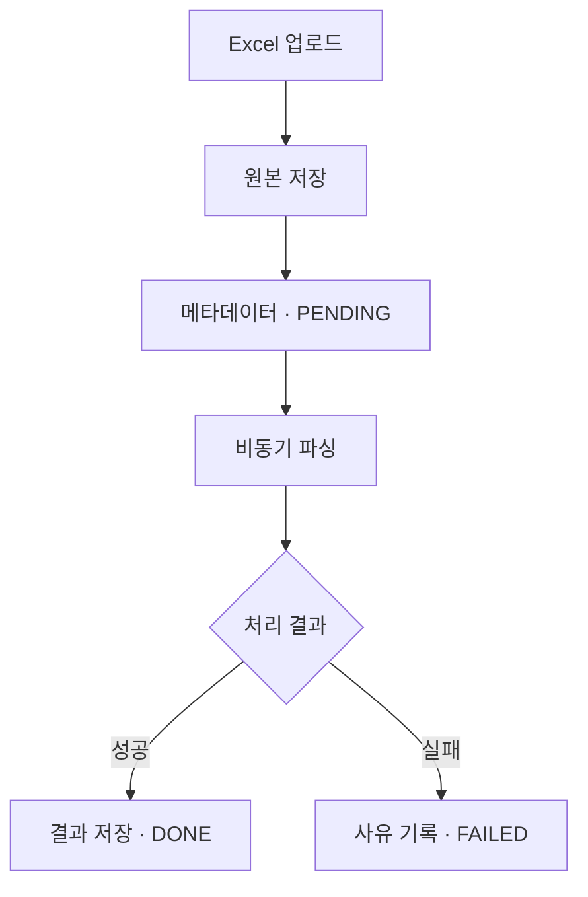
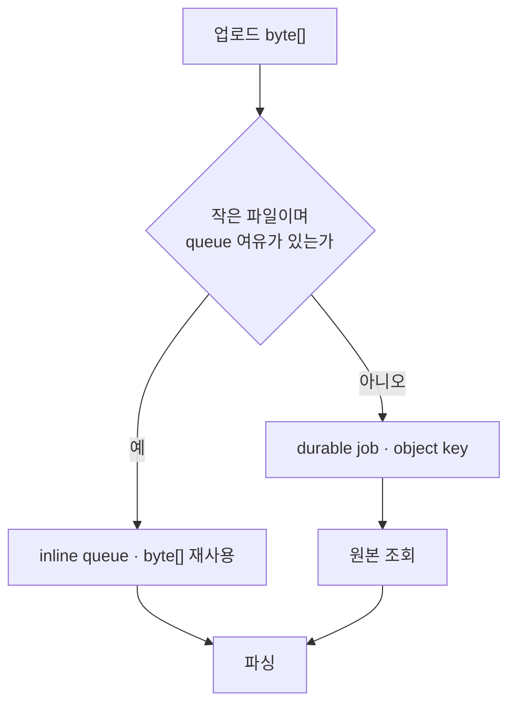
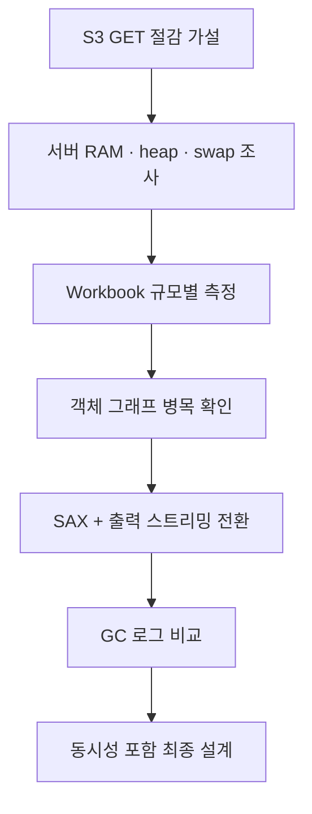
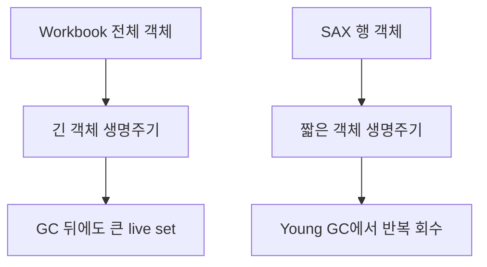
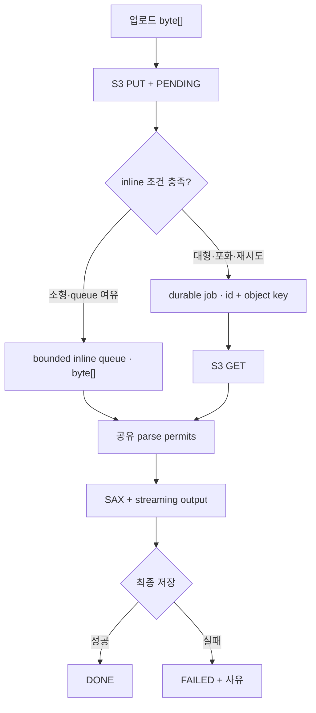

# Excel Streaming Parser Study

제한된 JVM heap에서 가변 크기의 `.xlsx` 파일을 처리하기 위해, Excel 업로드·비동기 파싱 기능을 구현하는 과정에서 Apache POI Workbook 전체 로딩 방식과 SAX 기반 스트리밍 방식을 비교하고 파싱 구조를 개선한 인턴십 기술 연구입니다.

> [!NOTE]
> 이 저장소는 회사 자료를 제외해 내용이 비어 있는 요약본이 아닙니다. 인턴십 중 수행한 **기능 구현, 요구사항 분석, 가설, 환경 조사, 실험 조건과 측정값, 설계 판단**을 보존하고, 공개할 수 없는 회사 소스 코드·고객 파일·내부 식별 정보만 제거하거나 일반화한 공개판입니다. 실제 회사 코드를 옮기지 않았기 때문에 코드 예시는 당시 구현과 판단을 설명하는 공개용 스케치로 다시 작성했습니다. 운영 배포 범위와 운영 트래픽 성과는 별도로 구분합니다.

## 목차

- [연구 개요](#연구-개요)
- [핵심 결론](#핵심-결론)
- [가설의 전개와 판단 과정](#가설의-전개와-판단-과정)
- [실험과 결과](#실험과-결과)
- [최종 설계](#최종-설계)
- [연구의 마무리](#연구의-마무리)
- [검증 범위](#검증-범위)
- [상세 문서](#상세-문서)
- [공개 범위](#공개-범위)

## 연구 개요

| 항목 | 내용 |
|---|---|
| 업무 맥락 | 업로드된 Excel 원본을 저장하고 비동기로 파싱해 JSON 형태로 제공하는 기능 개발 |
| 담당 | Excel 업로드·비동기 파싱 기능 구현, API·상태 설계, 서버 자원 조사, JVM 메모리 실험, 파싱 방식 비교 |
| 대상 | 업무 요구사항: `.xls`, `.xlsx` / 비교 실험: `.xlsx` |
| 기술 | Java 17, Apache POI, SAX, Jackson `JsonGenerator`, G1GC, S3, PostgreSQL JSONB |
| 결과 | Workbook 기준선과 SAX·출력 스트리밍 대안을 구현·실행하고, 메모리 병목을 객체 그래프와 전체 결과 적재로 재정의해 파싱 구조와 초기 동시성 정책을 결정 |
| 근거 | 합성 `.xlsx` 단일 실행의 단계별 heap 관측과 GC 로그 |

사용자가 Excel 파일을 올린 뒤 필요한 처리 범위는 다음과 같았습니다.



## 핵심 결론

업로드 과정에서 생성된 `byte[]`를 파싱 단계까지 재사용해, 원본 저장 뒤 다시 S3에서 읽던 접근을 파일당 2회(`PUT + GET`)에서 1회(`PUT`)로 줄였습니다. 이 과정에서 데이터가 queue와 parser에 오래 남아 동시 처리 여유가 줄어드는 문제가 드러났고, 원본 파일보다 Workbook 전체 객체와 파싱 결과를 동시에 유지하는 구조가 훨씬 큰 heap 압력을 만든다는 점을 측정으로 확인했습니다.

| 구분 | 처음 본 문제 | 측정 후 다시 정의한 문제 |
|---|---|---|
| 주요 비용 | object storage 재조회 | Workbook·Row·Cell과 전체 결과의 긴 생명주기 |
| 제어 대상 | inline `byte[]` queue | 파서 구조, 출력 방식과 전체 동시 작업 수 |
| 선택 | 업로드 데이터 재사용으로 GET 생략 | bounded inline reuse + durable fallback + SAX·출력 스트리밍 |

> 검증된 소형 파일은 업로드 데이터를 bounded inline queue에서 재사용해 S3 GET을 생략합니다. 대형 파일·queue 포화·재시도는 object key 기반 durable 경로로 처리합니다. 두 경로 모두 SAX 행 단위 파싱과 출력 스트리밍을 사용하고, 공유 permit으로 전체 동시 작업을 제한합니다.

## 가설의 전개와 판단 과정

### 1. 최초 가설: 업로드 `byte[]` 재사용

업로드 요청에서는 object storage로 보낼 원본 `byte[]`가 이미 만들어집니다. 이 값을 작은 용량의 JVM inline queue로 넘기면 파싱 worker가 파일을 다시 조회하지 않아도 되므로, **작은 파일은 메모리에서 바로 처리하고 큰 파일은 object key만 전달하는 이중 경로**를 처음 검토했습니다.



가설의 첫 메모리 예산은 다음과 같이 단순했습니다.

```text
queuedRawBytes = inlineQueueCapacity × inlineThreshold

예시
inlineThreshold = 1MiB
queueCapacity   = 4
queuedRawBytes  = 4MiB
```

| 가설이 유효한 조건 | 가설을 수정해야 하는 조건 |
|---|---|
| 원본 `byte[]`가 작업당 메모리의 큰 비중을 차지 | Workbook과 결과 객체가 원본보다 훨씬 큼 |
| inline queue의 상한만으로 heap 점유를 제한 가능 | 실행 중인 parser 수가 heap 압력을 좌우 |
| S3 재조회 생략이 주요 병목을 줄임 | 파싱 객체 생성·유지가 더 큰 병목 |

### 2. 환경 조사: 실제 메모리 예산 재계산

운영 환경의 특정 시점을 조사했을 때 서버 RAM은 약 1.9GiB, JVM MaxHeap은 약 478MiB였고 swap은 없었습니다. JVM heap만 늘리면 OS, native memory, thread stack과 같은 영역의 여유가 줄어들기 때문에 다음 항목을 함께 예산에 넣었습니다.

```text
처리 중 필요한 heap
= 대기 중인 원본 byte[]
 + 실행 중인 Workbook / Sheet / Row / Cell
 + 전체 파싱 결과 List
 + JSON 직렬화 결과
 + worker별 중간 객체
 + GC 및 운영 안전 여유
```

이 계산으로 질문은 “queue에 원본을 몇 개 넣을 수 있는가?”에서 “**파싱 한 건이 만드는 전체 live set을 제한할 수 있는가?**”로 바뀌었습니다.

### 3. 반례와 수정 가설

Workbook 방식으로 입력 크기를 늘려 측정한 결과, 2.306MiB의 압축 파일도 400,020개 셀을 객체로 펼치고 전체 결과를 유지하면서 파싱 직후 heap이 약 408.8MiB 증가했습니다. 5.753MiB 파일은 `-Xmx512m`과 `-Xmx768m`에서 모두 OOM이 발생했습니다.

따라서 최초 가설을 폐기한 것이 아니라 적용 범위를 줄였습니다. S3 GET 생략은 작은 파일의 보조 최적화가 될 수 있지만, 기본 파싱 구조는 다음 수정 가설을 먼저 만족해야 했습니다.

> 전체 Workbook과 결과를 동시에 유지하지 않고 행 단위로 읽고 쓰면, 입력 행 수가 증가해도 live set을 제한된 범위에서 반복 회수할 수 있다.

### 4. 판단 흐름



| 단계 | 확인한 내용 | 다음 판단 |
|---|---|---|
| 1. 환경 조사 | 서버 RAM 약 1.9GiB, JVM MaxHeap 약 478MiB, swap 0 | 원본 파일뿐 아니라 파싱 중 live set을 제한해야 함 |
| 2. Workbook 측정 | 파일 크기보다 셀 객체와 전체 결과가 크게 증가 | queue 용량만으로는 위험을 제어할 수 없음 |
| 3. 반례 확인 | 50,000행 입력이 `-Xmx512m`, `-Xmx768m`에서 OOM | Xmx 증설보다 객체 생명주기 변경을 우선 |
| 4. SAX 전환 | 같은 입력을 `-Xmx512m`에서 처리 완료 | 행과 결과를 모두 스트리밍하는 방식 채택 |
| 5. GC 분석 | Young GC 뒤 live set이 반복 회수되고 Full GC·OOM 없음 | 제한된 worker와 결합할 설계 근거 확보 |

시간순 질문과 대안은 [의사결정 기록](docs/investigation-log.md)에 정리했습니다.

## 실험과 결과

### 실험 질문

```text
Q1. 원본 xlsx byte[]가 heap 사용의 주된 원인인가?
Q2. Workbook 객체와 전체 파싱 결과는 입력 규모에 따라 얼마나 커지는가?
Q3. 512MiB급 heap에서 Workbook 방식의 위험은 어디서 드러나는가?
Q4. SAX + streaming output은 같은 대규모 입력을 제한된 heap에서 완료하는가?
Q5. GC 로그에서 두 방식의 객체 회수 패턴은 어떻게 다른가?
```

### 비교 조건

| 항목 | Workbook 기준선 | SAX 비교안 |
|---|---|---|
| JVM | Java 17, G1GC | Java 17, G1GC |
| 기본 heap | `-Xms256m -Xmx512m` | `-Xms256m -Xmx512m` |
| 입력 | 약 20개 컬럼의 합성 `.xlsx` | 동일 입력 |
| 파싱 | 전체 Workbook 로딩 | sheet XML 행 이벤트 |
| 출력 | 전체 rows와 JSON bytes 적재 | `JsonGenerator` → buffered temp file |
| 측정 | 단계별 used heap·시간 | GC log |

S3, DB, HTTP와 운영 트래픽은 제외해 파서 구조의 메모리 특성을 분리했습니다.

<details>
<summary><strong>측정 지점과 수치 해석</strong></summary>

Workbook 기준선에서는 파일 읽기, Workbook 파싱, JSON 직렬화 직후의 used heap을 각각 기록했습니다.

```java
long heapBefore = usedHeap();

byte[] bytes = Files.readAllBytes(path);
long heapAfterRead = usedHeap();

ParsedExcelData data = parseWithWorkbook(bytes);
long heapAfterParse = usedHeap();

byte[] json = objectMapper.writeValueAsBytes(data);
long heapAfterJson = usedHeap();
```

```java
private static long usedHeap() {
    Runtime runtime = Runtime.getRuntime();
    return runtime.totalMemory() - runtime.freeMemory();
}
```

이 값은 각 코드 체크포인트의 used heap입니다. 샘플링 사이의 순간 최대값을 보장하지 않으므로 `peak heap`이라고 부르지 않았습니다. SAX 방식은 GC 이벤트 전후 값을 사용했으므로 두 측정은 절대값을 직접 비교하기보다 객체 생명주기와 OOM 여부를 함께 해석했습니다.

</details>

### Workbook 결과

| 행 / 셀 | 파일 크기 | Xmx | 결과 | 파싱 시간 | 파싱 직후 heap 증가 |
|---:|---:|---:|---|---:|---:|
| 1,000 / 20,020 | 0.119MiB | 512MiB | 완료 | 1.171s | 약 67.2MiB |
| 5,000 / 100,020 | 0.580MiB | 512MiB | 완료 | 2.158s | 약 124.3MiB |
| 20,000 / 400,020 | 2.306MiB | 512MiB | 완료 | 6.547s | 약 408.8MiB |
| 50,000 / 1,000,020 | 5.753MiB | 512MiB | OOM | - | - |
| 50,000 / 1,000,020 | 5.753MiB | 768MiB | OOM | - | - |
| 50,000 / 1,000,020 | 5.753MiB | 1GiB | 완료 | 9.079s | 약 967.8MiB |

여기서 heap 증가는 코드 체크포인트의 used heap 차이이며 실행 전체의 정확한 peak가 아닙니다.

### SAX GC 관측

| 입력 | Xmx | 결과 | GC 로그 관측 |
|---|---:|---|---|
| 20,000행 / 400,020셀 | 512MiB | 완료 | 약 222MiB → Young GC 뒤 약 73MiB, pause 대체로 3–5ms |
| 50,000행 / 1,000,020셀 | 512MiB | 완료 | `217M→69M(256M) 3.616ms`, pause 대체로 3–6ms |

두 실행 모두 기록에서 Full GC, OOM과 `to-space exhausted`가 나타나지 않았습니다. GC 이벤트 값은 이벤트 시점의 관측값이며 실행 전체 peak를 뜻하지 않습니다.



### 결과 해석

| 관측 | 해석 | 설계에 반영한 내용 |
|---|---|---|
| 2.306MiB 파일에서 파싱 직후 heap 약 408.8MiB 증가 | 압축 파일 크기는 객체 그래프 크기를 대표하지 못함 | 업로드 크기뿐 아니라 행·셀·출력 크기를 함께 제한 |
| 50,000행이 512MiB·768MiB에서 OOM | Xmx 증설만으로 객체 생명주기 문제를 해결하기 어려움 | Workbook 전체 로딩을 기본 경로에서 제거 |
| SAX 50,000행이 512MiB에서 완료 | 행 단위 처리와 출력 스트리밍이 live set 제한에 유효 | SAX + `JsonGenerator` + buffered temp file 채택 |
| Young GC 뒤 약 69–73MiB로 반복 회수 | 행 단위 중간 객체가 짧게 살아남는 패턴 | parser 전체 동시성을 제한해 동시 live set 제어 |

이 실험은 단순히 SAX 라이브러리가 더 빠른지를 비교한 것이 아닙니다. **Workbook 전체 모델과 전체 결과를 동시에 유지하는 설계**와 **행 이벤트를 받아 출력까지 순차 처리하는 설계**를 비교해, 메모리 안전성을 만드는 객체 생명주기의 차이를 확인한 것입니다.

원시 수치, 측정 지점과 해석은 [실험 보고서](docs/experiment-report.md) 및 [결과 CSV](results/workbook-measurements.csv)에서 확인할 수 있습니다.

## 최종 설계



| 영역 | 설계 결정 | 이유 |
|---|---|---|
| 파싱 | `.xlsx`를 SAX 행 단위로 처리 | 전체 Workbook 객체 그래프 제거 |
| 출력 | `JsonGenerator`와 buffer로 임시 파일에 순차 기록 | 전체 rows와 JSON bytes의 동시 적재 방지 |
| 작업 전달 | 소형은 bounded `byte[]` 재사용, 대형·포화·재시도는 id + object key | GET 생략과 durable 복구를 함께 유지 |
| 동시성 | 모든 파싱 경로가 공유하는 permit 적용 | queue별 worker 합산으로 동시 실행이 늘어나는 문제 방지 |
| 상태 | 최종 저장 성공 뒤 `DONE`, 오류 시 `FAILED` | 파싱 성공과 결과 저장 성공을 구분 |
| 복구 | 임시 파일 정리, idempotency와 `PENDING` 복구 정책 | 실패·재시작 조건에서 중복과 잔여 파일 방지 |

구현 수준의 흐름과 트랜잭션 경계는 [아키텍처 문서](docs/architecture.md)에 정리했습니다.

### 계산으로 정한 초기 동시성·큐 설정

관측 환경의 MaxHeap `478MiB` 중 25%를 GC 변동과 다른 요청을 위한 여유로 남겨, admission 예산을 `358.5MiB`로 두었습니다. queue는 검증된 소형 파일만 `1MiB` 이하로 최대 4건 보관하도록 계산했습니다.

```text
사용 가능 예산 = 478 × 0.75 = 358.5MiB

baseline/post-GC 관측 상한               = 73MiB
small 1건의 보수적 증가분                = 124.3MiB
  └ Workbook 5,000행 관측값을 proxy로 사용
large 1건의 SAX 증가분                   = 222 - 73 = 149MiB
inline 대기 원본                         = 1MiB × 4건 = 4MiB
```

| 실행 조합 | 계산 | 예상 점유 | 결정 |
|---|---:|---:|---|
| small 2건 + inline queue | `73 + 124.3×2 + 4` | `325.6MiB` | 허용, 예산 내 여유 `32.9MiB` |
| large 1건 + small 1건 + queue | `73 + 149 + 124.3 + 4` | `350.3MiB` | 여유가 `8.2MiB`뿐이라 제외 |
| large 2건 + inline queue | `73 + 149×2 + 4` | `375.0MiB` | 예산 초과 |

| 설정 | 초기값 | 적용 방식 |
|---|---:|---|
| 공유 parse permits | 2 | 모든 파싱 경로가 같은 예산 사용 |
| small 작업 weight | 1 | small 2건 동시 실행 가능 |
| large 작업 weight | 2 | large 1건이 전체 permit 점유 |
| inline queue capacity | 4 jobs | worker 밖에서 대기하는 raw data 상한 |
| inline threshold | 1MiB | 5,000행 합성 파일 `0.580MiB`를 위로 둥글린 초기 routing 값 |
| durable fallback | 항상 유지 | 대형·queue 포화·재시도는 id와 object key 전달 |

`small`은 압축 크기 `1MiB` 이하이면서 업로드 단계에서 5,000행·100,020셀 이하임을 검증할 수 있는 입력입니다. 행·셀 수를 알 수 없으면 inline으로 추정하지 않고 durable 경로로 보냅니다. 이 수치는 실제 동시 트래픽의 최대 처리량이 아니라 단일 실행 관측값에서 출발한 **보수적인 초기 admission policy**입니다.

### S3 접근과 비용 해석

```text
기존 경로  = PUT 1회 + 파싱용 GET 1회 = 파일당 S3 접근 2회
inline 경로 = PUT 1회                  = 파일당 S3 접근 1회

접근 횟수 감소율 = (2 - 1) / 2 × 100 = 50%
직접 절감량       = inline 처리 건수 × GET 요청 단가 1회분
```

따라서 **inline 파일의 S3 접근 횟수를 50% 줄였다**는 결론은 성립합니다. 다만 전체 AWS 청구액에는 저장 용량, PUT, 데이터 전송, 다른 서비스와 durable 경로의 GET도 포함되므로 전체 비용이 50% 감소했다고 확대하지 않습니다.
## 연구의 마무리

이 연구는 “더 검증해야 한다”는 문장으로 끝난 작업이 아니라, 제한된 heap 환경에서 어떤 파싱 구조를 선택해야 하는지 결정하기 위한 기술 조사였습니다.

| 이번 연구에서 완료한 판단 | 실제 운영 환경에서 확인할 결과 |
|---|---|
| Excel 업로드·비동기 파싱 기능 구현 | 실제 배포 범위와 장애율 변화 |
| Workbook 기준선과 SAX + streaming output 대안 구현·실행 | 반복 실행의 평균·p95/p99 |
| 주된 메모리 병목과 Workbook 방식의 위험 범위 확인 | 최종 최대 업로드 크기·행·셀 수 |
| bounded 재사용을 포함해 small 2건 또는 large 1건, inline queue 4건의 초기 상한 계산 | 실제 트래픽의 처리량·queue wait와 안정성 |
| 작업 상태·실패·복구를 포함한 구조 결정 | S3·DB 포함 end-to-end 시간과 비용 변화 |

따라서 결과는 기능을 설계만 한 상태가 아니라, **Workbook 기준선과 SAX 대안을 구현·실행해 파싱 구조를 결정하고 초기 동시성·큐 값을 계산한 상태**입니다. 오른쪽 항목은 구현 여부가 아니라 서비스 트래픽·배포 환경에서 그 값의 처리량, 안정성과 비용 효과를 확인하는 운영 검증 범위입니다.

## 검증 범위

| 구분 | 내용 |
|---|---|
| 실험으로 확인 | Workbook 50,000행의 512MiB·768MiB OOM, SAX 스트리밍 512MiB 완료, 두 방식의 GC 패턴 차이 |
| 계산으로 결정 | MaxHeap 25% 여유 기준 small 2건 또는 large 1건, inline queue 4건(`1MiB` 이하) |
| 설계에 반영 | bounded inline reuse, durable fallback, SAX·출력 스트리밍, 공유 동시성·상태·실패 처리 |
| 별도 운영 검증 | 반복 평균·p95/p99, 동시 처리량, S3·DB 포함 시간, 실제 비용과 최종 지원 상한 |
| 기능 정합성 검증 | 수식·날짜·병합 셀·여러 sheet 등 다양한 Excel 의미의 동등성 확인 |

이 구분은 결과를 축소하기 위한 면책이 아니라 **격리된 파서 실험의 결론과 운영 KPI를 서로 바꾸어 말하지 않기 위한 범위 표시**입니다. 상세한 적용 범위와 운영 검증 계획은 [검증 범위와 후속 확인](docs/limitations-and-next-steps.md)에 정리했습니다.

## 상세 문서

| 궁금한 내용 | 문서 |
|---|---|
| 질문이 어떻게 바뀌었는가 | [의사결정 기록](docs/investigation-log.md) |
| 어떤 조건과 값으로 측정했는가 | [실험 보고서](docs/experiment-report.md) |
| 실제 서비스 구조에 어떻게 적용하는가 | [아키텍처 설계](docs/architecture.md) |
| 결론을 어디까지 적용할 수 있는가 | [검증 범위와 후속 확인](docs/limitations-and-next-steps.md) |
| Workbook 원시 측정값 | [workbook-measurements.csv](results/workbook-measurements.csv) |
| GC 이벤트 관측값 | [gc-observations.csv](results/gc-observations.csv) |

### 간소화 전 세부 내용의 보존 위치

README를 읽기 쉬운 진입점으로 줄이면서 긴 설명을 삭제하지 않고 아래 문서로 이동했습니다.

| README에서 압축한 내용 | 상세 문서의 보존 위치 | 포함된 세부 내용 |
|---|---|---|
| 기능 요구사항과 상태 흐름 | [의사결정 기록](docs/investigation-log.md), [아키텍처](docs/architecture.md) | 업로드·메타데이터·비동기 처리·`PENDING/DONE/FAILED` |
| 운영 서버 제약 조사 | [의사결정 기록](docs/investigation-log.md) | JVM flag, heap·metaspace, 서버 RAM, swap, 프록시 제한 |
| S3 GET 절감 가설 | [의사결정 기록](docs/investigation-log.md) | inline queue, object key 경로, 메모리 예산과 가설의 위험 |
| Workbook 기준 코드와 측정법 | [실험 보고서](docs/experiment-report.md) | 실험 질문, 단계별 측정 지점, 원시 JSON 기록과 수치 정의 |
| 입력 크기별 전체 결과 | [실험 보고서](docs/experiment-report.md), [Workbook CSV](results/workbook-measurements.csv) | 1k·5k·20k·50k 행, Xmx별 성공·OOM, 시간·heap·JSON 크기 |
| SAX 전환과 streaming output | [아키텍처](docs/architecture.md), [실험 보고서](docs/experiment-report.md) | sheet event 처리, 행 정렬, 값 변환, `JsonGenerator`, buffer와 임시 파일 |
| GC 로그 비교 | [실험 보고서](docs/experiment-report.md), [GC CSV](results/gc-observations.csv) | 20k·50k 이벤트, pause, Full GC·OOM 여부, Workbook과의 회수 패턴 차이 |
| 트랜잭션·동시성·복구 | [아키텍처](docs/architecture.md) | commit 이후 작업 발행, 공유 semaphore, backpressure, idempotency, 임시 파일 정리 |
| 결과 적용 범위와 운영 검증 | [검증 범위와 후속 확인](docs/limitations-and-next-steps.md) | 합성 입력·단일 실행·정합성·동시 처리·비용·지원 상한의 검증 계획 |
| 당시 기록과 공개 재현의 구분 | [실험 보고서](docs/experiment-report.md), [검증 범위와 후속 확인](docs/limitations-and-next-steps.md) | 회사 연구 기록의 보존 범위와 이후 벤치마크 분리 원칙 |

## 공개 범위

| 보존한 연구 내용 | 제거·일반화한 정보 |
|---|---|
| 기능 요구사항과 상태 모델 | 회사 소스 코드와 저장소 경로 |
| 최초 가설과 반례, 판단 변화 | 실제 고객 Excel 파일과 cell 데이터 |
| 서버 자원 규모와 JVM 제약 | 서버 IP·계정·프로세스 식별자 |
| 합성 데이터 조건과 측정값 | 회사·서비스·구성원 식별 정보 |
| 파싱·출력·동시성·실패 처리 설계 | 원문 내부 링크와 공개할 수 없는 업무 메모 |

문서의 Java 코드와 일부 다이어그램은 보존된 기록의 의미를 설명하기 위해 공개용으로 다시 작성했습니다. 측정값은 당시 연구 기록에서 옮긴 값이며 새로 만들어 보완한 값이 아닙니다. 이후 공개 벤치마크를 추가할 경우 별도 디렉터리와 날짜로 분리합니다.
