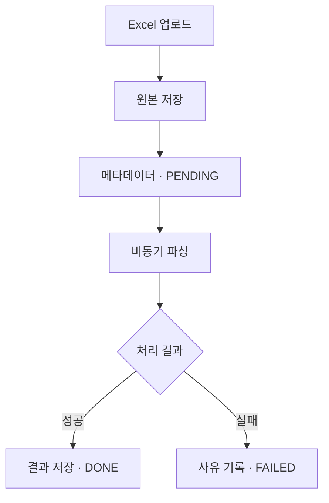
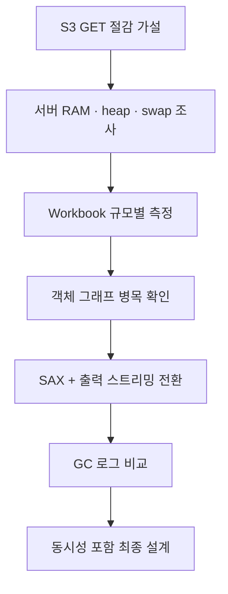
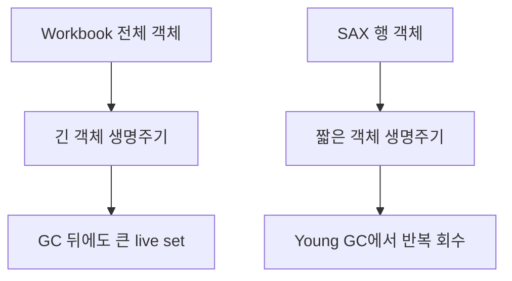
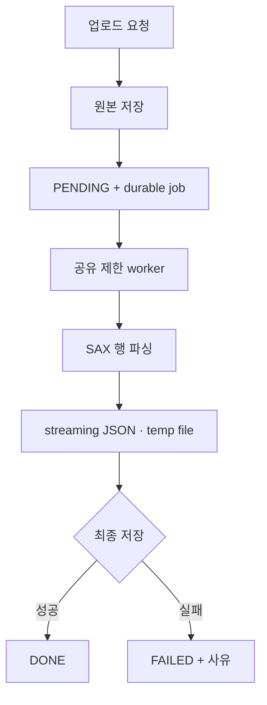

# Excel Streaming Parser Study

제한된 JVM heap에서 가변 크기의 `.xlsx` 파일을 처리하기 위해, Apache POI Workbook 전체 로딩 방식과 SAX 기반 스트리밍 방식을 비교하고 파싱 구조를 재설계한 인턴십 기술 연구입니다.

> [!NOTE]
> 이 저장소는 회사 자료를 제외해 내용이 비어 있는 요약본이 아닙니다. 인턴십 중 수행한 **요구사항 분석, 가설, 환경 조사, 실험 조건과 측정값, 설계 판단**을 보존하고, 공개할 수 없는 회사 소스 코드·고객 파일·내부 식별 정보만 제거하거나 일반화한 공개판입니다. 코드 예시는 당시 기록을 설명하기 위해 새로 작성한 공개용 스케치입니다.

## 목차

- [연구 개요](#연구-개요)
- [핵심 결론](#핵심-결론)
- [판단 과정](#판단-과정)
- [실험과 결과](#실험과-결과)
- [최종 설계](#최종-설계)
- [연구의 마무리](#연구의-마무리)
- [검증 범위](#검증-범위)
- [상세 문서](#상세-문서)
- [공개 범위](#공개-범위)

## 연구 개요

| 항목 | 내용 |
|---|---|
| 업무 맥락 | 업로드된 Excel 원본을 저장하고 비동기로 파싱해 JSON 형태로 제공하는 기능 검토 |
| 담당 | 요구사항 분석, API·상태 설계, 서버 자원 조사, JVM 메모리 실험, 파싱 방식 비교 |
| 대상 | 업무 요구사항: `.xls`, `.xlsx` / 비교 실험: `.xlsx` |
| 기술 | Java 17, Apache POI, SAX, Jackson `JsonGenerator`, G1GC, S3, PostgreSQL JSONB |
| 결과 | 메모리 병목을 원본 `byte[]`가 아닌 Workbook 객체 그래프와 전체 결과 적재로 재정의하고 SAX·출력 스트리밍 구조를 설계 |
| 근거 | 합성 `.xlsx` 단일 실행의 단계별 heap 관측과 GC 로그 |

사용자가 Excel 파일을 올린 뒤 필요한 처리 범위는 다음과 같았습니다.

## 핵심 결론

초기에는 업로드 과정의 `byte[]`를 재사용해 S3 GET 한 번을 줄이는 것을 주요 최적화 대상으로 보았습니다. 하지만 측정 결과 원본 파일보다 Workbook 전체 객체와 파싱 결과를 동시에 유지하는 구조가 훨씬 큰 heap 압력을 만들었습니다.

| 구분 | 처음 본 문제 | 측정 후 다시 정의한 문제 |
|---|---|---|
| 주요 비용 | object storage 재조회 | Workbook·Row·Cell과 전체 결과의 긴 생명주기 |
| 제어 대상 | inline `byte[]` queue | 파서 구조, 출력 방식과 전체 동시 작업 수 |
| 선택 | 작은 파일 fast path 검토 | SAX 행 단위 파싱 + streaming output |

> 제한된 heap에서 가변 크기의 `.xlsx`를 처리할 때는 S3 재조회 한 번을 줄이는 것보다 Workbook 전체 로딩과 전체 결과 적재를 제거하는 것이 우선입니다. 파싱과 출력을 함께 스트리밍하고 전체 parser 동시성을 공유 제한하는 방향을 채택했습니다.

## 판단 과정

| 단계 | 확인한 내용 | 다음 판단 |
|---|---|---|
| 1. 환경 조사 | 서버 RAM 약 1.9GiB, JVM MaxHeap 약 478MiB, swap 0 | 원본 파일뿐 아니라 파싱 중 live set을 제한해야 함 |
| 2. Workbook 측정 | 파일 크기보다 셀 객체와 전체 결과가 크게 증가 | queue 용량만으로는 위험을 제어할 수 없음 |
| 3. 반례 확인 | 50,000행 입력이 `-Xmx512m`, `-Xmx768m`에서 OOM | Xmx 증설보다 객체 생명주기 변경을 우선 |
| 4. SAX 전환 | 같은 입력을 `-Xmx512m`에서 처리 완료 | 행과 결과를 모두 스트리밍하는 방식 채택 |
| 5. GC 분석 | Young GC 뒤 live set이 반복 회수되고 Full GC·OOM 없음 | 제한된 worker와 결합할 설계 근거 확보 |

시간순 질문과 대안은 [의사결정 기록](docs/investigation-log.md)에 정리했습니다.

## 실험과 결과

### 조건

| 항목 | Workbook 기준선 | SAX 비교안 |
|---|---|---|
| JVM | Java 17, G1GC | Java 17, G1GC |
| 기본 heap | `-Xms256m -Xmx512m` | `-Xms256m -Xmx512m` |
| 입력 | 약 20개 컬럼의 합성 `.xlsx` | 동일 입력 |
| 파싱 | 전체 Workbook 로딩 | sheet XML 행 이벤트 |
| 출력 | 전체 rows와 JSON bytes 적재 | `JsonGenerator` → buffered temp file |
| 측정 | 단계별 used heap·시간 | GC log |

S3, DB, HTTP와 운영 트래픽은 제외해 파서 구조의 메모리 특성을 분리했습니다.

### Workbook 결과

| 행 / 셀 | 파일 크기 | Xmx | 결과 | 파싱 시간 | 파싱 직후 heap 증가 |
|---:|---:|---:|---|---:|---:|
| 1,000 / 20,020 | 0.119MiB | 512MiB | 완료 | 1.171s | 약 67.2MiB |
| 5,000 / 100,020 | 0.580MiB | 512MiB | 완료 | 2.158s | 약 124.3MiB |
| 20,000 / 400,020 | 2.306MiB | 512MiB | 완료 | 6.547s | 약 408.8MiB |
| 50,000 / 1,000,020 | 5.753MiB | 512MiB | OOM | - | - |
| 50,000 / 1,000,020 | 5.753MiB | 768MiB | OOM | - | - |
| 50,000 / 1,000,020 | 5.753MiB | 1GiB | 완료 | 9.079s | 약 967.8MiB |

여기서 heap 증가는 코드 체크포인트의 used heap 차이이며 실행 전체의 정확한 peak가 아닙니다.

### SAX GC 관측

| 입력 | Xmx | 결과 | GC 로그 관측 |
|---|---:|---|---|
| 20,000행 / 400,020셀 | 512MiB | 완료 | 약 222MiB → Young GC 뒤 약 73MiB, pause 대체로 3–5ms |
| 50,000행 / 1,000,020셀 | 512MiB | 완료 | `217M→69M(256M) 3.616ms`, pause 대체로 3–6ms |

두 실행 모두 기록에서 Full GC, OOM과 `to-space exhausted`가 나타나지 않았습니다. GC 이벤트 값은 이벤트 시점의 관측값이며 실행 전체 peak를 뜻하지 않습니다.

원시 수치, 측정 지점과 해석은 [실험 보고서](docs/experiment-report.md) 및 [결과 CSV](results/workbook-measurements.csv)에서 확인할 수 있습니다.

## 최종 설계

| 영역 | 설계 결정 | 이유 |
|---|---|---|
| 파싱 | `.xlsx`를 SAX 행 단위로 처리 | 전체 Workbook 객체 그래프 제거 |
| 출력 | `JsonGenerator`와 buffer로 임시 파일에 순차 기록 | 전체 rows와 JSON bytes의 동시 적재 방지 |
| 작업 전달 | raw bytes 대신 id와 object key 전달 | queue 대기 중 원본 데이터의 heap 점유 방지 |
| 동시성 | 모든 파싱 경로가 공유하는 permit 적용 | queue별 worker 합산으로 동시 실행이 늘어나는 문제 방지 |
| 상태 | 최종 저장 성공 뒤 `DONE`, 오류 시 `FAILED` | 파싱 성공과 결과 저장 성공을 구분 |
| 복구 | 임시 파일 정리, idempotency와 `PENDING` 복구 정책 | 실패·재시작 조건에서 중복과 잔여 파일 방지 |

구현 수준의 흐름과 트랜잭션 경계는 [아키텍처 문서](docs/architecture.md)에 정리했습니다.

## 연구의 마무리

이 연구는 “더 검증해야 한다”는 문장으로 끝난 작업이 아니라, 제한된 heap 환경에서 어떤 파싱 구조를 선택해야 하는지 결정하기 위한 기술 조사였습니다.

| 이번 연구에서 완료한 판단 | 운영 적용 단계에서 결정할 정책 |
|---|---|
| 주된 메모리 병목 식별 | 최종 최대 업로드 크기·행·셀 수 |
| Workbook 전체 로딩 방식의 위험 범위 확인 | 반복 실행 기준의 안전 여유 |
| SAX + streaming output 대안 구현·실행 | 동시 worker·queue capacity |
| GC 로그로 객체 회수 패턴 비교 | S3·DB를 포함한 end-to-end 상한 |
| 작업 상태·동시성·실패 처리를 포함한 구조 제안 | 실제 트래픽의 처리량·지연과 비용 |

따라서 연구 결과는 **SAX와 출력 스트리밍을 후속 구현의 기본 구조로 채택한다**는 설계 결론까지 도달했습니다. 오른쪽 항목은 연구가 미완성이라 남은 것이 아니라, 서비스 트래픽·배포 환경·제품 정책을 함께 보고 정해야 하는 운영 단계의 값입니다.

## 검증 범위

| 구분 | 내용 |
|---|---|
| 실험으로 확인 | Workbook 50,000행의 512MiB·768MiB OOM, SAX 스트리밍 512MiB 완료, 두 방식의 GC 패턴 차이 |
| 설계에 반영 | Workbook·전체 결과 적재 제거, durable job, 공유 동시성 제한, 상태·실패 처리 |
| 별도 운영 검증 | 반복 평균·p95/p99, 동시 처리량, S3·DB 포함 시간, 실제 비용과 최종 지원 상한 |
| 기능 정합성 검증 | 수식·날짜·병합 셀·여러 sheet 등 다양한 Excel 의미의 동등성 확인 |

이 구분은 결과를 축소하기 위한 면책이 아니라 **격리된 파서 실험의 결론과 운영 KPI를 서로 바꾸어 말하지 않기 위한 범위 표시**입니다. 상세한 적용 범위와 운영 검증 계획은 [검증 범위와 후속 확인](docs/limitations-and-next-steps.md)에 정리했습니다.

## 상세 문서

| 궁금한 내용 | 문서 |
|---|---|
| 질문이 어떻게 바뀌었는가 | [의사결정 기록](docs/investigation-log.md) |
| 어떤 조건과 값으로 측정했는가 | [실험 보고서](docs/experiment-report.md) |
| 실제 서비스 구조에 어떻게 적용하는가 | [아키텍처 설계](docs/architecture.md) |
| 결론을 어디까지 적용할 수 있는가 | [검증 범위와 후속 확인](docs/limitations-and-next-steps.md) |
| Workbook 원시 측정값 | [workbook-measurements.csv](results/workbook-measurements.csv) |
| GC 이벤트 관측값 | [gc-observations.csv](results/gc-observations.csv) |

## 공개 범위

| 보존한 연구 내용 | 제거·일반화한 정보 |
|---|---|
| 기능 요구사항과 상태 모델 | 회사 소스 코드와 저장소 경로 |
| 최초 가설과 반례, 판단 변화 | 실제 고객 Excel 파일과 cell 데이터 |
| 서버 자원 규모와 JVM 제약 | 서버 IP·계정·프로세스 식별자 |
| 합성 데이터 조건과 측정값 | 회사·서비스·구성원 식별 정보 |
| 파싱·출력·동시성·실패 처리 설계 | 원문 내부 링크와 공개할 수 없는 업무 메모 |

문서의 Java 코드와 일부 다이어그램은 보존된 기록의 의미를 설명하기 위해 공개용으로 다시 작성했습니다. 측정값은 당시 연구 기록에서 옮긴 값이며 새로 만들어 보완한 값이 아닙니다. 이후 공개 벤치마크를 추가할 경우 별도 디렉터리와 날짜로 분리합니다.
