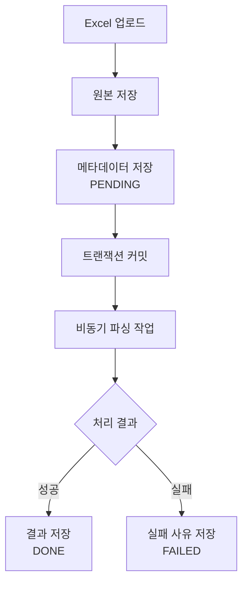
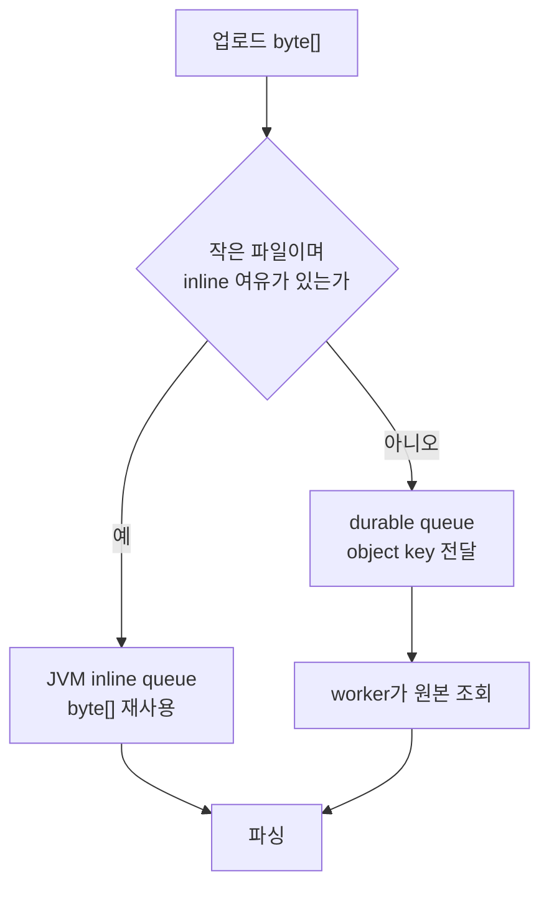
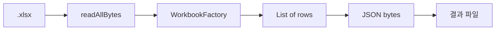
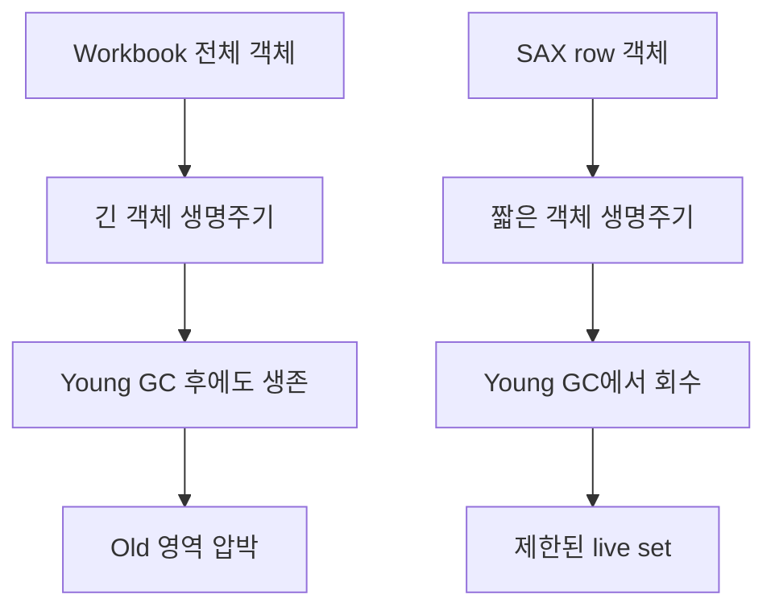
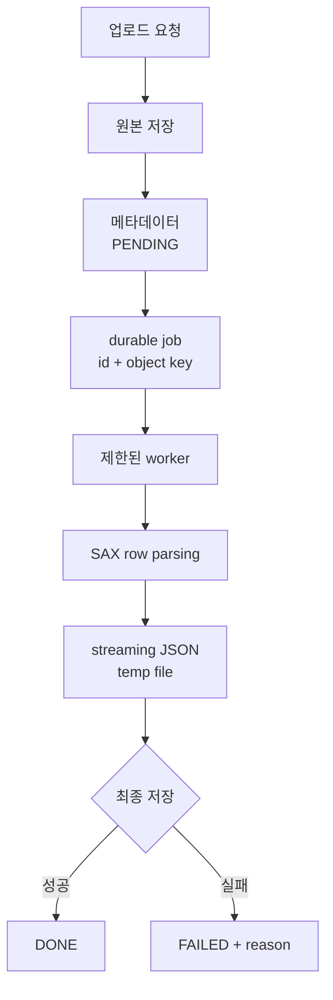

# Excel Streaming Parser Study

제한된 JVM heap 환경에서 가변 크기의 `.xlsx` 파일을 안전하게 처리하기 위해, Apache POI Workbook 전체 로딩 방식과 SAX 기반 스트리밍 방식을 비교한 인턴십 기술 사례입니다.

> 이 저장소는 회사의 운영 코드가 아닙니다. 인턴십 중 작성한 실험 기록을 바탕으로 회사 코드·고객 데이터·내부 식별 정보를 제외하고 공개용으로 재구성한 문서입니다.

## 프로젝트 정보

| 항목 | 내용 |
|---|---|
| 구분 | 인턴십 업무 기반 기술 사례 |
| 담당 | 요구사항 분석, API·상태 설계, 운영 환경 조사, JVM 메모리 실험, 파싱 방식 비교 |
| 대상 형식 | 업무 요구사항: `.xls`, `.xlsx` / 비교 실험: `.xlsx` |
| 주요 기술 | Java 17, Apache POI, SAX, Jackson `JsonGenerator`, G1GC, S3, PostgreSQL JSONB |
| 검증 범위 | 로컬 합성 데이터 단일 실행 및 GC 로그 분석 |
| 운영 반영 | 확인되지 않음 |
| 공개 범위 | 익명화한 설계·실험 결과·구현 스케치 |

## 핵심 결론

처음에는 업로드 과정에서 생성된 `byte[]`를 재사용해 S3 GET 한 번을 줄이는 것을 주요 최적화 대상으로 보았습니다. 그러나 측정 결과, 원본 파일보다 Workbook 전체 객체와 파싱 결과를 한꺼번에 유지하는 구조가 훨씬 큰 heap 압력을 만들었습니다.

```text
초기 질문
업로드 byte[]를 재사용해 S3 GET을 줄일 수 있는가?

측정 후 질문
Workbook과 전체 결과를 heap에 쌓지 않고
같은 논리 결과를 만들 수 있는가?
```

합성 `.xlsx` 파일을 사용한 로컬 실험에서 Workbook 방식은 50,000행을 `-Xmx512m`과 `-Xmx768m`에서 처리하지 못했습니다. 같은 입력을 SAX 스트리밍 방식으로 처리한 실행은 `-Xmx512m`에서 완료됐습니다.

따라서 이 사례의 결론은 다음과 같습니다.

> 제한된 heap에서 가변 크기의 `.xlsx`를 처리할 때는 S3 재조회 한 번을 줄이는 것보다, Workbook 전체 로딩과 전체 결과 적재를 제거하는 것이 우선이다. 파싱은 SAX로 행 단위 처리하고 결과도 스트리밍하며, 전체 동시 작업 수를 공유 제한해야 한다.

이 결론은 **로컬 파서 프로토타입의 설계 방향**에 관한 것입니다. 운영 적용 완료나 실제 서비스 성능 개선을 의미하지 않습니다.

## 문제 상황

사용자가 Excel 파일을 업로드하면 다음 요구사항을 만족해야 했습니다.

- 원본 파일을 private object storage에 저장
- 업로드한 사용자와 파일 메타데이터 기록
- HTTP 응답과 파싱 작업 분리
- 가변 컬럼의 header와 rows 파싱
- 파싱 결과를 JSON 형태로 조회
- 처리 상태를 `PENDING`, `DONE`, `FAILED`로 관리
- 실패 원인과 처리 완료 시각 기록

목표 처리 흐름은 다음과 같습니다.



상세 조회 응답은 상태에 따라 달라지는 구조를 검토했습니다.

```json
{
  "id": "excel-id",
  "status": "DONE",
  "downloadUrl": "short-lived-presigned-url",
  "headers": ["name", "phone", "memo"],
  "rows": [
    ["Kim", "01012345678", ""],
    ["Lee", "01099998888", "sample"]
  ]
}
```

## 제약 환경

운영 환경 조사 당시 확인한 값은 다음과 같았습니다. 공개 문서에서는 서버와 서비스 식별 정보는 제외하고 자원 규모만 일반화했습니다.

| 항목 | 관측값 | 해석 범위 |
|---|---:|---|
| 서버 RAM | 약 1.9GiB | 특정 시점의 인스턴스 규모 |
| JVM MaxHeap | 501,219,328 bytes, 약 478MiB | 명시적 `-Xmx512m`이 아닌 JVM 산정값 |
| 관측 당시 heap used | 약 98MiB | 순간값, peak 아님 |
| Metaspace used | 약 107MiB | heap과 별도 |
| available memory | 약 575MiB | 캐시 회수 가능량을 포함한 순간값 |
| Swap | 0 | 메모리 압박 시 지연보다 OOM 위험이 빠르게 드러남 |

JVM heap만 보고 파일 처리 예산을 정할 수는 없습니다.

```text
전체 RAM
- OS와 프록시 여유
- 모니터링 에이전트와 다른 프로세스 RSS
- JVM non-heap 영역
- thread stack과 native memory
- 운영 안전 여유
= JVM heap에 배정 가능한 상한
```

업로드 제한도 한 계층만 수정하면 일관되지 않습니다.

```text
Proxy request body limit
          =
Spring multipart limit
          =
Service file validation policy
```

각 값은 동일한 제품 정책을 표현해야 하며, 설정 상속과 실제 업로드 요청으로 확인해야 합니다.

## 최초 가설

업로드 요청에서 이미 생성된 `byte[]`를 JVM 내부 큐로 전달하면, 파싱 worker가 object storage에서 파일을 다시 가져오지 않아도 됩니다. 작은 파일에는 이 경로를 사용하고, 큰 파일이나 큐가 찬 경우에는 object key만 durable queue에 전달하는 방식을 검토했습니다.



초기 판단은 다음 식에 기반했습니다.

```text
queuedRawBytes = inlineQueueCapacity × inlineThreshold

예시
inlineThreshold = 1MiB
queueCapacity   = 4
queuedRawBytes  = 4MiB
```

하지만 이 계산은 **파싱 중 생성되는 객체 그래프**를 포함하지 않았습니다.

```text
실제 필요한 예산
= 대기 중인 원본 byte[]
 + 실행 중인 Workbook 객체
 + 파싱 결과 List 객체
 + JSON 직렬화 결과
 + worker별 중간 객체
 + GC와 운영 안전 여유
```

## Workbook 방식

첫 번째 실험은 현재 처리 흐름을 단순화한 CLI로 진행했습니다.



대표적인 코드 흐름은 다음과 같습니다. 실제 회사 코드는 포함하지 않았습니다.

```java
byte[] input = Files.readAllBytes(filePath);

try (Workbook workbook = WorkbookFactory.create(
        new ByteArrayInputStream(input))) {
    ParsedExcelData parsed = parseAllRows(workbook);
    byte[] json = objectMapper.writeValueAsBytes(parsed);
    Files.write(outputPath, json);
}
```

이 방식에서는 다음 객체가 같은 처리 구간에 함께 살아 있을 수 있습니다.

```text
compressed xlsx byte[]
Workbook / Sheet / Row / Cell
SharedStrings / Styles / Formula evaluation state
List<List<String>>
serialized JSON byte[]
```

`.xlsx`는 ZIP 기반 압축 형식이기 때문에 파일 크기만으로 메모리 사용량을 판단할 수 없습니다. 작은 압축 파일도 많은 셀, 긴 문자열, 스타일과 shared strings를 펼치는 과정에서 훨씬 큰 객체 그래프를 만들 수 있습니다.

## Workbook 실험

### 목적

- 압축 파일 크기와 파싱 heap 사용량의 관계 확인
- inline threshold와 worker 수를 정할 근거 확보
- `byte[]` 재사용이 실제 주요 최적화 지점인지 확인
- 전체 결과를 JSONB 형태로 만들 때의 위험 확인

### 환경

| 구분 | 조건 |
|---|---|
| JVM | Java 17, G1GC |
| 기본 heap | `-Xms256m -Xmx512m` |
| 추가 heap 조건 | `-Xmx768m`, `-Xmx1g` |
| 파서 | Apache POI `WorkbookFactory` |
| 입력 | 약 20개 컬럼을 가진 합성 `.xlsx` |
| 결과 | header와 전체 rows를 메모리에 구성 후 JSON 직렬화 |
| 제외 | S3, DB, HTTP, Spring Security, 운영 트래픽 |
| 반복 | 조건별 단일 실행 기록 |

### 측정 지점

```java
long heapBefore = usedHeap();

byte[] bytes = Files.readAllBytes(path);
long heapAfterRead = usedHeap();

ParsedExcelData data = parseWithWorkbook(bytes);
long heapAfterParse = usedHeap();

byte[] json = objectMapper.writeValueAsBytes(data);
long heapAfterJson = usedHeap();
```

```java
private static long usedHeap() {
    Runtime runtime = Runtime.getRuntime();
    return runtime.totalMemory() - runtime.freeMemory();
}
```

이 값은 각 코드 체크포인트의 used heap입니다. 샘플링 사이의 최대값을 보장하지 않으므로 `peak heap`이라고 표현하지 않습니다.

### 결과

| 행 / 셀 | 파일 크기 | Xmx | 결과 | 파싱 시간 | 파싱 직후 heap 증가 | JSON 크기 |
|---:|---:|---:|---|---:|---:|---:|
| 1,000 / 20,020 | 0.119MiB | 512MiB | 성공 | 1.171s | 약 67.2MiB | 255,160 bytes |
| 5,000 / 100,020 | 0.580MiB | 512MiB | 성공 | 2.158s | 약 124.3MiB | 1,282,545 bytes |
| 20,000 / 400,020 | 2.306MiB | 512MiB | 성공, 한계 근접 | 6.547s | 약 408.8MiB | 5,153,760 bytes |
| 50,000 / 1,000,020 | 5.753MiB | 512MiB | OOM | - | - | - |
| 50,000 / 1,000,020 | 5.753MiB | 768MiB | OOM | - | - | - |
| 50,000 / 1,000,020 | 5.753MiB | 1GiB | 성공, 한계 근접 | 9.079s | 약 967.8MiB | 12,914,543 bytes |

전체 수치는 [실험 보고서](docs/experiment-report.md)에 정리했습니다.

### 분석

1. 2.306MiB의 압축 파일도 40만 개 셀을 객체로 펼치고 전체 결과를 유지하면서 약 408.8MiB의 heap 증가가 관측됐습니다.
2. 5.753MiB의 압축 파일은 512MiB뿐 아니라 768MiB heap에서도 완료되지 않았습니다.
3. 원본 `byte[]`보다 Workbook과 전체 결과 객체가 더 큰 위험이었습니다.
4. inline queue 크기만 제한해서는 실행 중인 parser의 메모리 압력을 제어할 수 없습니다.
5. Xmx만 늘리면 OS와 native memory의 안전 여유가 줄어들며, 객체 생명주기 문제를 해결하지 못합니다.

## 설계 전환

Workbook 실험 뒤에 파싱 구조를 SAX 기반 event streaming으로 바꿨습니다.


핵심은 SAX로 읽는 것만이 아니라 **출력도 스트리밍하는 것**입니다.

```java
try (OutputStream fileOut = Files.newOutputStream(tempFile);
     BufferedOutputStream buffered = new BufferedOutputStream(fileOut, 64 * 1024);
     JsonGenerator json = jsonFactory.createGenerator(buffered)) {

    json.writeStartObject();
    json.writeArrayFieldStart("rows");

    saxParser.parse(sheetInputStream, new RowHandler(row -> {
        writeRow(json, row);
        // row를 전체 List에 보관하지 않고 다음 이벤트로 이동
    }));

    json.writeEndArray();
    json.writeEndObject();
}
```

아래처럼 SAX 결과를 다시 모으면 메모리 절감 효과가 줄어듭니다.

```java
// 피해야 할 구조
List<List<String>> rows = new ArrayList<>();

saxParser.parse(sheetInputStream, new RowHandler(row -> {
    rows.add(row); // 전체 결과가 처리 완료까지 heap에 남음
}));

byte[] json = objectMapper.writeValueAsBytes(rows);
```

버퍼링을 적용한 이유는 행마다 `write()`를 호출하더라도 매번 실제 디스크 쓰기를 발생시키지 않기 위해서입니다.

```text
JsonGenerator
    ↓ write(row)
BufferedOutputStream 내부 buffer
    ↓ buffer가 찼을 때
OS write system call
    ↓
page cache
    ↓
physical disk flush
```

## SAX GC 로그

### 환경

```text
GC: G1GC
Heap region size: 1MiB
Initial heap: 256MiB
Maximum heap: 512MiB
Input: Workbook 실험과 동일한 합성 파일
Output: SAX row event → JsonGenerator → buffered temp file
```

### 20,000행 관측

- 입력: 2.306MiB, 20,000 rows, 400,020 cells
- GC 로그에서 heap이 약 222MiB까지 상승
- Young GC 뒤 약 73MiB 수준으로 반복 회수
- Full GC와 OOM 기록 없음
- 기록된 GC pause는 대체로 3~5ms

### 50,000행 관측

```text
GC(7) Pause Young (Normal) (G1 Evacuation Pause)
217M->69M(256M) 3.616ms
```

- 입력: 5.753MiB, 50,000 rows, 1,000,020 cells
- `-Xmx512m`에서 처리 완료
- GC 로그에서 약 217MiB까지 상승 후 약 69MiB로 회수
- Full GC, OOM, to-space exhausted 기록 없음
- 기록된 GC pause는 대체로 3~6ms

### Workbook 로그와의 차이

Workbook 20,000행 실행 기록에서는 GC가 약 30회 발생했습니다. 일부 GC 전후 값은 `174M→173M`, `246M→239M`처럼 회수 폭이 작았고, committed heap이 `-Xmx512m`까지 확장되는 흐름이 나타났습니다.



GC 로그에 기록된 값은 GC 이벤트 시점의 관측값입니다. 이벤트 사이의 정확한 순간 peak를 의미하지 않습니다.

## 최종 설계안



### 파싱 방식

- `.xlsx`는 SAX 행 단위 처리
- 전체 `Workbook`과 전체 rows를 동시에 유지하지 않음
- `JsonGenerator`로 JSON을 순차 생성
- `BufferedOutputStream`으로 디스크 호출 수 완화
- 임시 파일 완료 후 최종 저장

### 작업 전달

- 대용량 작업은 `byte[]` 대신 식별자와 object key 전달
- 장시간 대기할 수 있는 메모리 참조를 durable job으로 전환
- 동일 작업의 중복 실행 방지를 위한 idempotency 필요
- 트랜잭션 커밋 뒤 파싱 작업 발행

```java
public record ExcelParseJob(
        UUID excelId,
        String objectKey,
        String extension,
        long fileSize
) {}
```

### 동시성 제어

각 queue의 worker 수를 별개로 제한하면 전체 parser 동시성이 초과될 수 있습니다. 모든 파싱 경로가 공유하는 제한이 필요합니다.

```java
Semaphore parsePermits = new Semaphore(2);

void parseSmall(Job job) {
    parsePermits.acquire(1);
    try {
        parse(job);
    } finally {
        parsePermits.release(1);
    }
}

void parseLarge(Job job) {
    parsePermits.acquire(2);
    try {
        parse(job);
    } finally {
        parsePermits.release(2);
    }
}
```

이 코드는 설계 의도를 설명하는 공개용 스케치입니다. 실제 운영 코드를 복사한 것이 아니며, permit 수 역시 최종 운영값이 아닙니다.

### 완료와 실패

```text
PENDING
  ├─ parse success + result persist success → DONE
  └─ parse error / persist error            → FAILED
```

- 결과 저장까지 성공해야 `DONE`
- 파싱 성공 후 저장 실패도 `FAILED`
- 실패 사유는 사용자 메시지와 운영 로그를 분리
- 임시 파일은 성공·실패 모두 정리
- 프로세스 재시작 시 `PENDING` 작업 복구 정책 필요

## 판단 변화

| 단계 | 질문 | 확인 | 판단 |
|---|---|---|---|
| 1 | S3 GET을 생략할 수 있는가 | 업로드 `byte[]` 재사용 가능성 | 작은 파일 fast path 검토 |
| 2 | 운영 서버가 감당할 수 있는가 | RAM·heap·swap·다른 프로세스 확인 | 파일·queue·worker 제한 필요 |
| 3 | 원본 파일이 주된 heap 비용인가 | Workbook 크기별 측정 | 파싱 객체와 전체 결과가 더 큰 위험 |
| 4 | Xmx 증설로 해결 가능한가 | 50k가 768MiB에서도 OOM | 구조 변경 우선 |
| 5 | SAX만 적용하면 충분한가 | 전체 rows를 모으면 live set 유지 | 출력까지 스트리밍 |
| 6 | 제한된 heap에서 처리되는가 | SAX 50k가 512MiB에서 완료 | 후속 파싱 전략으로 채택 |

더 자세한 시간순 기록은 [의사결정 기록](docs/investigation-log.md)을 참고하세요.

## 결과 해석

### 확인된 사실

- Workbook 전체 로딩 방식은 합성 50,000행 입력을 512MiB와 768MiB heap에서 완료하지 못했습니다.
- 같은 입력의 SAX 스트리밍 실행은 512MiB heap에서 완료됐습니다.
- 원본 압축 파일 크기만으로 파싱 메모리를 예측할 수 없었습니다.
- 전체 결과를 heap에 모으면 SAX의 장점이 줄어듭니다.
- parser 동시성을 queue별이 아니라 전체적으로 제어해야 한다는 설계 근거를 얻었습니다.

### 확인되지 않은 내용

- 운영 배포 완료 여부
- 실제 사용자 파일에 대한 성공률
- 반복 실행 평균과 p95/p99
- 동시 worker 처리량과 지연
- end-to-end S3·DB 처리 시간
- AWS 청구 비용 절감률
- 최종 upload limit, queue capacity, inline threshold

## 한계

1. 합성 `.xlsx`와 로컬 단일 실행 중심의 결과입니다.
2. 체크포인트 used heap과 GC 이벤트 값을 사용했으며 정확한 전체 실행 peak가 아닙니다.
3. Workbook과 SAX의 출력 정합성을 모든 셀 유형에서 자동 비교하지 않았습니다.
4. 병합 셀, 수식, 날짜·숫자 스타일, 빈 중간 셀, shared strings와 여러 sheet 정책을 추가 검증해야 합니다.
5. `.xls`, CSV, Numbers는 SAX 비교 대상이 아닙니다.
6. JSONB 저장, JDBC driver buffering과 최종 결과 크기 상한을 측정하지 않았습니다.
7. 동시 처리, queue 포화, worker 장애와 프로세스 재시작 조건을 실험하지 않았습니다.
8. 운영 반영 후 장애율·처리량·사용자 대기 시간은 확인하지 않았습니다.

상세 내용은 [한계와 후속 검증](docs/limitations-and-next-steps.md)에 정리했습니다.

## 후속 검증

```text
1. Workbook과 SAX 출력 hash 비교
2. 동일 조건 반복 실행
3. JFR + GC log + max RSS 수집
4. worker 1/2 동시 처리 비교
5. S3와 최종 저장을 포함한 end-to-end 측정
6. 결과 크기 제한과 실패 복구 검증
7. 운영 상한 확정
```

최종 운영값은 한 번 성공한 최대값이 아니라 다음 조건으로 결정해야 합니다.

```text
safe operating condition
= repeatable input boundary
 + concurrent request budget
 + JVM and OS safety margin
 + recoverable failure policy
```

## 문서 구성

- [의사결정 기록](docs/investigation-log.md): 최초 가설부터 설계 전환까지의 시간순 기록
- [실험 보고서](docs/experiment-report.md): 환경, 측정 방법, 원시 수치와 해석
- [아키텍처](docs/architecture.md): 초기안과 수정안, 상태·동시성·실패 처리
- [한계와 후속 검증](docs/limitations-and-next-steps.md): 주장 범위와 남은 실험
- [Workbook 측정 CSV](results/workbook-measurements.csv)
- [GC 관측 CSV](results/gc-observations.csv)

## 공개 원칙

- 회사의 소스 코드와 실제 고객 파일을 포함하지 않습니다.
- 서버 IP, 계정, 저장소·프로세스 이름과 구성원 이름을 제거했습니다.
- 입력은 합성 데이터의 규모와 특성만 기록합니다.
- 당시 관측과 공개용 재구성을 구분합니다.
- 측정하지 않은 비용, 처리량과 운영 성과를 주장하지 않습니다.
- 원본 업무 노트는 내부 정보와 미확정 가설을 포함하므로 비공개로 유지합니다.

## 저장소 상태

현재 저장소는 기록을 공개 가능한 기술 사례로 재구성한 단계입니다. 당시 실험 실행 코드와 원본 로그 파일은 보존 여부가 확인되지 않아 포함하지 않았습니다. 문서 속 Java 코드는 처리 구조를 설명하기 위한 공개용 스케치입니다.

재현 가능한 벤치마크 코드가 추가될 경우, 인턴 당시 코드가 아니라 기록을 바탕으로 새로 작성한 공개용 구현임을 별도 커밋과 문서에서 명시할 예정입니다.
