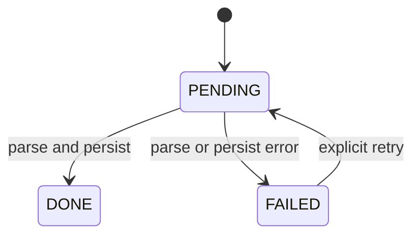
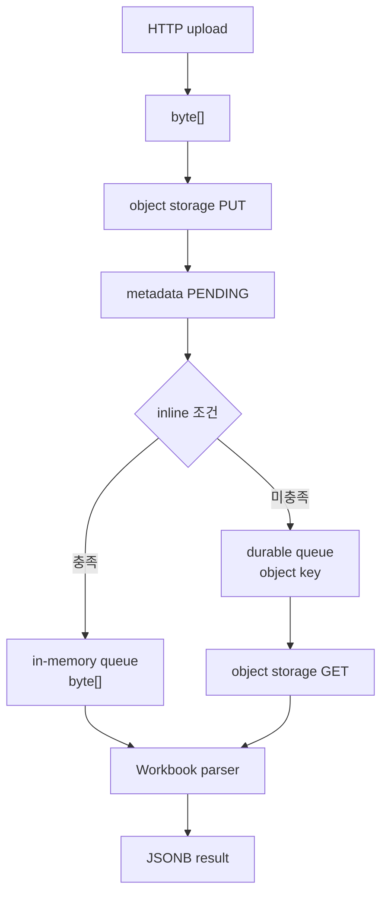
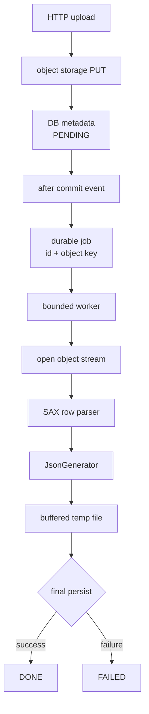
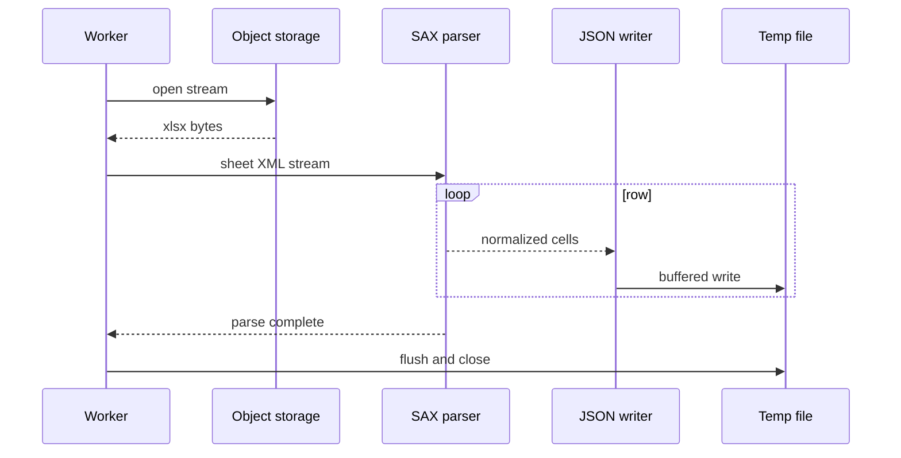
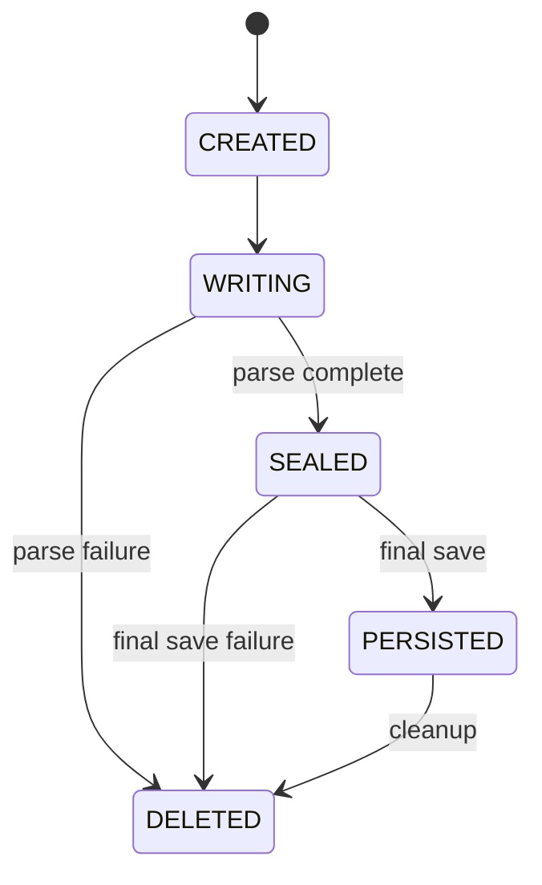
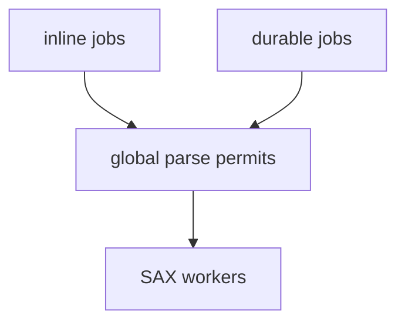

# 아키텍처 설계

> [README](../README.md) · [의사결정 기록](investigation-log.md) · [실험 보고서](experiment-report.md) · [검증 범위와 후속 확인](limitations-and-next-steps.md)

## 1. 범위

이 문서는 엑셀 업로드 요청, 비동기 파싱, 결과 저장과 상태 조회를 분리한 설계안을 설명합니다. 특정 회사의 실제 인프라 토폴로지나 운영 코드는 포함하지 않습니다.

## 2. 상태 모델

| 상태 | 의미 | 응답 |
|---|---|---|
| `PENDING` | 업로드와 메타데이터 저장 완료, 파싱 대기 또는 실행 중 | 파일 메타데이터와 진행 상태 |
| `DONE` | 파싱과 최종 결과 저장 완료 | 메타데이터, 다운로드 URL, headers, rows |
| `FAILED` | 파싱 또는 최종 저장 실패 | 메타데이터, 실패 안내 |



`DONE` 전환 기준은 parser 반환이 아니라 최종 결과가 조회 가능한 상태까지 저장된 시점입니다.

## 3. 초기 구조

### 목표

- 업로드 요청을 빠르게 반환
- 작은 파일은 기존 `byte[]` 재사용
- object storage GET 요청 한 번 생략
- 즉시 작업과 지연 작업 분리



### 문제

```text
queue의 byte[] 보유량만 계산
→ 실행 중 Workbook live set 누락
→ 여러 worker가 동시에 실행되면 예산 초과
```

`byte[]`의 대기 시간도 HTTP 처리보다 길어집니다.

```text
request thread releases response
≠
queued byte[] becomes collectible
```

큐가 참조하고 있는 동안 GC는 파일 데이터를 회수할 수 없습니다.

## 4. 수정 구조

### 핵심 원칙

1. HTTP 요청과 파싱 실행 분리
2. durable job에는 원본 byte array가 아닌 식별자 전달
3. 전체 Workbook을 만들지 않는 SAX 처리
4. 전체 결과를 모으지 않는 streaming output
5. 전체 parser 공유 동시성 제한
6. 최종 저장과 상태 전환의 일관성 보장



## 5. 트랜잭션 경계

작업은 메타데이터 트랜잭션이 commit되기 전에 실행되면 안 됩니다.

```java
@Transactional
public ExcelUploadResponse upload(MultipartFile file) {
    StoredObject stored = objectStorage.put(file);
    ExcelRecord record = repository.save(
        ExcelRecord.pending(stored.key(), file.getOriginalFilename())
    );

    eventPublisher.publishEvent(
        new ExcelUploadedEvent(record.getId(), stored.key())
    );

    return ExcelUploadResponse.from(record);
}
```

```java
@TransactionalEventListener(phase = TransactionPhase.AFTER_COMMIT)
public void enqueue(ExcelUploadedEvent event) {
    durableQueue.publish(new ExcelParseJob(
        event.excelId(),
        event.objectKey()
    ));
}
```

위 코드는 공개용 설계 스케치입니다. 실제 운영 구현이 아닙니다.

### 실패 순서

| 실패 지점 | 필요한 처리 |
|---|---|
| object storage PUT 실패 | DB record를 만들지 않고 요청 실패 |
| DB 저장 실패 | 업로드한 object 정리 또는 orphan cleanup |
| job 발행 실패 | outbox 또는 재발행 대상 기록 |
| parse 실패 | `FAILED`, 사용자용 메시지와 내부 원인 분리 |
| final persist 실패 | `DONE`으로 전환하지 않음 |
| worker 종료 | visibility timeout 또는 lease 뒤 재처리 |

## 6. SAX 처리

### 이벤트 흐름



### 행 정렬

SAX 이벤트는 값이 없는 cell을 생략할 수 있으므로 cell reference를 기준으로 빈 중간 셀을 복원해야 합니다.

```java
int currentColumn = 0;

void onCell(String cellRef, String value) {
    int targetColumn = columnIndex(cellRef);

    while (currentColumn < targetColumn) {
        writeCell("");
        currentColumn++;
    }

    writeCell(value);
    currentColumn++;
}
```

### 값 변환

```text
cell type
├─ shared string → sharedStrings lookup
├─ inline string → inline text
├─ boolean       → true/false policy
├─ numeric       → style-aware formatting
├─ date          → style-aware date formatting
└─ formula       → cached result or explicit rejection policy
```

Workbook `DataFormatter`와 동일한 의미를 보장하려면 대표 입력의 출력 정합성 테스트가 필요합니다.

## 7. Streaming JSON

전체 결과를 heap에 모으지 않고 배열 구조를 순차 작성합니다.

```java
json.writeStartObject();

json.writeArrayFieldStart("headers");
for (String header : headers) {
    json.writeString(header);
}
json.writeEndArray();

json.writeArrayFieldStart("rows");
saxParser.forEachRow(row -> {
    json.writeStartArray();
    for (String value : row) {
        json.writeString(value);
    }
    json.writeEndArray();
});
json.writeEndArray();

json.writeEndObject();
```

header를 먼저 확정할 수 없는 입력이라면 다음 중 하나를 정해야 합니다.

- 첫 번째 유효 행을 header로 사용
- 별도 schema 입력을 요구
- 임시 header 영역을 기록한 뒤 rows 처리
- header가 없는 파일을 거부

## 8. 임시 파일 수명주기



```java
Path temp = Files.createTempFile("excel-parse-", ".json");

try {
    streamParseTo(temp);
    persistResult(temp);
    markDone();
} catch (Exception e) {
    markFailed(publicReason(e));
    throw e;
} finally {
    Files.deleteIfExists(temp);
}
```

추가로 디스크 사용량 상한, 전용 디렉터리, 주기적 orphan cleanup과 프로세스 종료 시 처리가 필요합니다.

## 9. 동시성 제한

### 잘못된 분리

```text
inlinePool.max = 2
deferredPool.max = 1

실제 최대 동시 parser = 3
```

각 pool은 다른 pool의 실행을 모르기 때문에 전체 메모리 예산을 초과할 수 있습니다.

### 공유 제한



```java
final class ParseAdmissionController {
    private final Semaphore permits;

    ParseAdmissionController(int totalPermits) {
        this.permits = new Semaphore(totalPermits, true);
    }

    <T> T execute(int weight, Callable<T> task) throws Exception {
        permits.acquire(weight);
        try {
            return task.call();
        } finally {
            permits.release(weight);
        }
    }
}
```

### 초기 permit 계산

```text
MaxHeap                         = 478MiB
25% 안전 여유를 제외한 예산       = 358.5MiB
baseline                        = 73MiB
large 증가분                    = 222 - 73 = 149MiB
small 증가분의 보수적 근사        = 124.3MiB

small 2건 = 73 + 124.3 × 2 = 321.6MiB
large 2건 = 73 + 149 × 2   = 371.0MiB
```

따라서 초기 admission 정책은 다음과 같습니다.

| 구분 | 값 |
|---|---:|
| total permits | 2 |
| small job weight | 1 |
| large job weight | 2 |
| 최대 동시 실행 | small 2건 또는 large 1건 |

`small`은 사전 검증으로 5,000행·100,020셀 이하가 확인된 입력만 해당합니다. 알 수 없는 입력과 그보다 큰 입력은 `large`로 분류해 permit 2개를 모두 사용합니다. `large + small`의 계산값은 346.3MiB로 358.5MiB 예산 안에 들어오지만 여유가 12.2MiB에 불과하므로 허용하지 않습니다.

이 값은 단일 실행의 관측값에서 도출한 보수적 초기 설정입니다. 동시 실행 throughput이나 p95 지연을 측정한 값은 아니므로 운영 telemetry로 재검토합니다.

## 10. Backpressure

```text
producer rate > parser throughput
→ queue grows
→ waiting time grows
→ retry/duplicate risk grows
```

초기 executor queue는 worker 상한의 2배인 **4 jobs**로 제한합니다. queue payload에는 원본 `byte[]`가 아니라 id와 object key만 넣고, 그보다 많은 작업은 durable `PENDING` 상태로 남겨 JVM 내부 대기열이 무한히 자라지 않게 합니다.

```text
parser_worker_max       = 2
executor_queue_capacity = parser_worker_max × 2 = 4
inline_raw_byte_queue   = disabled
```

함께 필요한 정책:

- queue depth 경보
- 최대 대기 시간
- 업로드 rate limit
- 작업 우선순위
- dead-letter queue
- idempotency key
- 동일 파일 중복 처리 방지
- 사용자가 확인할 수 있는 상태

## 11. 결과 저장 선택지

| 방식 | 장점 | 위험 |
|---|---|---|
| JSONB 단일 값 | 조회 구조 단순, 트랜잭션 처리 가능 | 큰 결과, driver buffering, DB row 팽창 |
| object storage JSON | 큰 결과에 유리, DB 부담 감소 | 별도 조회, URL과 권한 관리 |
| row table batch insert | 검색·부분 조회 가능 | 많은 row와 transaction 비용 |

현재 기록만으로 최종 저장 방식을 확정할 수 없습니다. parser heap이 줄어도 최종 JSONB 저장 단계에서 전체 값을 다시 메모리에 올리면 end-to-end 이점이 줄어들 수 있습니다.

## 12. 업로드 상한

압축 파일 크기 하나만으로 제한하면 충분하지 않습니다.

```text
upload policy
= compressed bytes
 + uncompressed package size
 + row/cell count
 + parsed result size
 + processing time
```

ZIP bomb 방어를 위해 압축 해제 비율과 entry size 제한도 필요합니다.

```java
ZipSecureFile.setMinInflateRatio(0.01);
ZipSecureFile.setMaxEntrySize(MAX_ENTRY_BYTES);
ZipSecureFile.setMaxTextSize(MAX_TEXT_BYTES);
```

구체적인 값은 라이브러리 버전, 데이터 분포와 운영 요구사항을 확인한 뒤 설정해야 합니다.

## 13. 관측 가능성

worker가 남겨야 할 최소 측정값:

```text
job id
input bytes
row count
cell count
output bytes
queue wait time
object read time
parse time
final persist time
total time
success/failure category
heap/RSS/GC metrics
```

로그에 원본 파일명, cell 값과 사용자 개인정보를 남기지 않습니다.

## 14. 초기 적용 값과 운영 확인 값

```yaml
parser_worker_max: 2
parse_permits: 2
small_job_weight: 1
large_job_weight: 2
executor_queue_capacity: 4
inline_raw_byte_queue_capacity: 0
queue_payload: id_and_object_key

max_upload_size: validate_with_real_workbooks
max_rows: validate_with_real_workbooks
max_cells: validate_with_real_workbooks
max_output_bytes: decide_after_validation
result_storage: decide_with_product_policy
retry_policy: decide_with_failure_policy
```

파싱 방식과 JVM admission의 초기값은 위와 같이 정리했습니다. 실제 처리량·queue wait·장애율·비용, 최종 지원 파일 범위는 [운영 적용을 위한 검증 계획](limitations-and-next-steps.md)에 따라 실제 트래픽과 end-to-end 경로에서 확인합니다.
