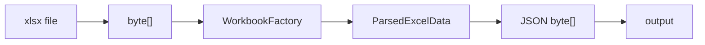
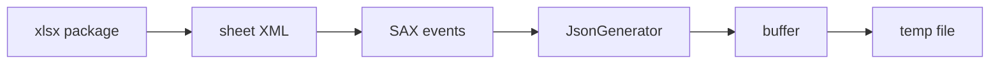

# 엑셀 파싱 실험 보고서

> [README](../README.md) · [의사결정 기록](investigation-log.md) · [아키텍처](architecture.md) · [검증 범위와 후속 확인](limitations-and-next-steps.md)

## 1. 실험 목적

`.xlsx` 업로드·파싱 기능에서 입력 규모에 따른 JVM heap 사용을 확인하고 다음 설계 판단의 근거를 만드는 것이 목적입니다.

- Workbook 전체 로딩 방식의 메모리 증가 확인
- 압축 파일 크기와 파싱 객체 크기의 차이 확인
- S3 GET 생략보다 중요한 병목 탐색
- SAX 스트리밍 방식으로 전환할 근거 확보
- worker와 queue 정책을 결정하기 전 위험 범위 확인

실험은 운영 서버에서 OOM을 재현하지 않고 로컬의 격리된 Java 프로세스에서 수행했습니다.

## 2. 실험 질문

```text
Q1. 원본 xlsx byte[]가 heap 사용의 주된 원인인가?
Q2. Workbook 객체와 전체 파싱 결과는 입력 규모에 따라 얼마나 커지는가?
Q3. 512MiB급 heap에서 처리 가능한 입력 범위는 어디인가?
Q4. SAX + streaming output은 같은 대규모 입력을 제한된 heap에서 처리할 수 있는가?
Q5. GC 로그에서 두 방식의 객체 회수 패턴은 어떻게 다른가?
```

## 3. 대상 흐름

### Workbook 기준선



### SAX 비교안



## 4. 환경

| 항목 | Workbook 실험 | SAX 실험 |
|---|---|---|
| 언어·런타임 | Java 17 | Java 17 |
| GC | G1GC | G1GC |
| 초기 heap | `-Xms256m` | `-Xms256m` |
| 기본 최대 heap | `-Xmx512m` | `-Xmx512m` |
| 추가 조건 | `-Xmx768m`, `-Xmx1g` | 없음 |
| 입력 형식 | `.xlsx` | `.xlsx` |
| 데이터 | 약 20개 컬럼의 합성 데이터 | 동일 합성 데이터 |
| 출력 | 전체 결과 객체 후 JSON bytes | JSON streaming temp file |
| 측정 | 단계별 used heap·시간 | GC log |

### 실험에서 제외한 영역

```text
HTTP request/response
Spring Security
object storage PUT/GET
network transfer
database connection
JSONB insert
production traffic
real customer files
```

이 제외 범위 때문에 결과를 end-to-end 서비스 성능으로 해석하면 안 됩니다.

## 5. 샘플 데이터

| 샘플 | 행 | 셀 | 압축 파일 크기 |
|---|---:|---:|---:|
| realistic-1k | 1,000 | 20,020 | 0.119MiB |
| realistic-5k | 5,000 | 100,020 | 0.580MiB |
| realistic-20k | 20,000 | 400,020 | 2.306MiB |
| realistic-50k | 50,000 | 1,000,020 | 5.753MiB |

`.xlsx`는 압축된 ZIP 패키지입니다. 같은 파일 크기라도 셀 수, 문자열 길이, shared strings, style, formula와 빈 셀 분포에 따라 파싱 메모리가 달라질 수 있습니다.

## 6. Workbook 측정 절차

```text
1. CLI 프로세스 시작
2. heapBefore 기록
3. Files.readAllBytes로 원본 byte[] 생성
4. heapAfterRead 기록
5. WorkbookFactory로 전체 Workbook 생성
6. header와 rows를 ParsedExcelData에 적재
7. heapAfterParse 기록
8. 전체 결과를 JSON byte[]로 직렬화
9. heapAfterJson 기록
10. metrics와 parsed JSON 파일 저장
```

실행 형식:

```bash
java -Xms256m -Xmx512m \
  -jar excel-parse-metrics-cli.jar \
  samples/sample-realistic-20k.xlsx
```

추가 heap 조건:

```bash
java -Xms256m -Xmx768m -jar excel-parse-metrics-cli.jar samples/sample-realistic-50k.xlsx
java -Xms256m -Xmx1g   -jar excel-parse-metrics-cli.jar samples/sample-realistic-50k.xlsx
```

## 7. 측정값 정의

```text
heapBefore
  파싱 시작 전 used heap

heapAfterRead
  원본을 byte[]로 읽은 직후 used heap

heapAfterParse
  Workbook과 ParsedExcelData를 만든 직후 used heap

heapAfterJson
  전체 JSON byte[]를 만든 직후 used heap
```

```text
heapDeltaAfterParse = heapAfterParse - heapBefore
heapDeltaAfterJson  = heapAfterJson  - heapBefore
```

`Runtime.totalMemory() - Runtime.freeMemory()`는 호출 시점의 used heap을 보여줄 뿐입니다. 다음을 측정하지 못합니다.

- 두 체크포인트 사이의 순간 최대 사용량
- 프로세스 전체 RSS
- native allocation
- 정확한 allocation rate
- GC가 측정 직전에 실행됐을 때의 왜곡

따라서 보고서에서는 `peak` 대신 **파싱 직후 used heap 증가**라고 표현합니다.

## 8. Workbook 결과

### 요약

| 샘플 | Xmx | 결과 | read | parse | JSON | total | 파싱 직후 heap 증가 |
|---|---:|---|---:|---:|---:|---:|---:|
| 1k | 512MiB | 성공 | 107ms | 1,171ms | 78ms | 1,358ms | 70,429,800 bytes |
| 5k | 512MiB | 성공 | 105ms | 2,158ms | 118ms | 2,383ms | 130,375,768 bytes |
| 20k | 512MiB | 성공 | 14ms | 6,547ms | 148ms | 6,713ms | 428,654,016 bytes |
| 50k | 512MiB | OOM | - | - | - | - | - |
| 50k | 768MiB | OOM | - | - | - | - | - |
| 50k | 1GiB | 성공 | 7ms | 9,079ms | 296ms | 9,384ms | 1,014,776,744 bytes |

각 조건은 단일 실행이므로 시간 값은 평균이나 percentile이 아닙니다.

### 1,000행 원시 기록

```json
{
  "fileSizeMiB": 0.119,
  "rowCount": 1000,
  "cellCount": 20020,
  "readBytesMs": 107,
  "parseMs": 1171,
  "jsonSerializeMs": 78,
  "totalMs": 1358,
  "heapBeforeBytes": 19360568,
  "heapAfterReadBytes": 19360568,
  "heapAfterParseBytes": 89790368,
  "heapAfterJsonBytes": 92666984,
  "heapDeltaAfterParseBytes": 70429800,
  "parsedJsonSizeBytes": 255160
}
```

### 5,000행 원시 기록

```json
{
  "fileSizeMiB": 0.580,
  "rowCount": 5000,
  "cellCount": 100020,
  "readBytesMs": 105,
  "parseMs": 2158,
  "jsonSerializeMs": 118,
  "totalMs": 2383,
  "heapBeforeBytes": 19359144,
  "heapAfterReadBytes": 20407720,
  "heapAfterParseBytes": 149734912,
  "heapAfterJsonBytes": 155587392,
  "heapDeltaAfterParseBytes": 130375768,
  "parsedJsonSizeBytes": 1282545
}
```

### 20,000행 원시 기록

```json
{
  "fileSizeMiB": 2.306,
  "rowCount": 20000,
  "cellCount": 400020,
  "readBytesMs": 14,
  "parseMs": 6547,
  "jsonSerializeMs": 148,
  "totalMs": 6713,
  "heapBeforeBytes": 19356736,
  "heapAfterReadBytes": 22502464,
  "heapAfterParseBytes": 448010752,
  "heapAfterJsonBytes": 400556752,
  "heapDeltaAfterParseBytes": 428654016,
  "parsedJsonSizeBytes": 5153760
}
```

`heapAfterJson`이 `heapAfterParse`보다 작은 것은 JSON 직렬화가 메모리를 사용하지 않았다는 뜻이 아닙니다. 두 측정 사이에 GC가 개입했을 수 있으므로 체크포인트 값만으로 단계별 최대 allocation을 분리할 수 없습니다.

### 50,000행·1GiB 원시 기록

```json
{
  "fileSizeMiB": 5.753,
  "rowCount": 50000,
  "cellCount": 1000020,
  "readBytesMs": 7,
  "parseMs": 9079,
  "jsonSerializeMs": 296,
  "totalMs": 9384,
  "heapBeforeBytes": 19360856,
  "heapAfterReadBytes": 25652312,
  "heapAfterParseBytes": 1034137600,
  "heapAfterJsonBytes": 984088704,
  "heapDeltaAfterReadBytes": 6291456,
  "heapDeltaAfterParseBytes": 1014776744,
  "heapDeltaAfterJsonBytes": 964727848,
  "parsedJsonSizeBytes": 12914543
}
```

원본 파일은 약 5.75MiB지만 파싱 직후 used heap 증가는 약 967.8MiB였습니다.

## 9. Workbook 결과 해석

### 원본 파일 크기

```text
50k file byte[]       약   6MiB
파싱 직후 heap 증가    약 968MiB
```

원본 `byte[]` 재사용 여부는 메모리 문제의 중심이 아니었습니다.

### 객체 생명주기

Workbook 방식에서는 다음 객체가 파싱 완료까지 참조될 수 있습니다.

```text
Workbook
└── Sheet
    └── Row
        └── Cell

SharedStrings
Styles
Formula-related objects
ParsedExcelData
└── List<List<String>>

serialized JSON byte[]
```

GC는 참조 중인 객체를 회수할 수 없기 때문에 Young GC가 반복되어도 live set이 유지될 수 있습니다.

### Xmx 증설

`-Xmx1g`에서 50k가 성공했다는 사실은 1GiB가 안전한 운영값이라는 뜻이 아닙니다.

```text
JVM heap 1GiB
+ metaspace
+ code cache
+ direct/native memory
+ thread stack
+ proxy/OS/agent
> 2GiB-class server의 안전 범위
```

한 번 성공한 최대값을 운영 상한으로 사용하면 동시 요청과 다른 트래픽을 위한 여유가 없습니다.

## 10. SAX 측정 절차

SAX 실험은 전체 Workbook과 전체 rows를 만들지 않고 sheet XML을 행 단위로 처리했습니다.

```text
open xlsx package
→ open sheet XML stream
→ parse row events
→ write row through JsonGenerator
→ buffer output
→ temp file
→ close and finalize
```

GC 로그 예시 실행 옵션:

```bash
java -Xms256m -Xmx512m \
  -Xlog:gc*:file=gc-50k-sax.log:time,uptime,level,tags \
  -jar sax-streaming-excel-parse-metrics-cli.jar \
  samples/sample-realistic-50k.xlsx
```

## 11. SAX GC 결과

### 20,000행

| 항목 | 관측 |
|---|---|
| 입력 | 2.306MiB / 20,000 rows / 400,020 cells |
| heap | GC 이벤트 전 약 222MiB까지 관측 |
| Young GC 후 | 약 73MiB 수준으로 반복 회수 |
| Full GC | 기록 없음 |
| OOM | 기록 없음 |
| GC pause | 대체로 3~5ms |

### 50,000행

대표 로그:

```text
GC(7) Pause Young (Normal) (G1 Evacuation Pause) 217M->69M(256M) 3.616ms
```

| 항목 | 관측 |
|---|---|
| 입력 | 5.753MiB / 50,000 rows / 1,000,020 cells |
| Xmx | 512MiB |
| 결과 | 처리 완료 |
| GC 이벤트 전 | 약 217MiB까지 관측 |
| Young GC 후 | 약 69MiB |
| Full GC | 기록 없음 |
| OOM | 기록 없음 |
| GC pause | 대체로 3~6ms |

SAX 20k와 50k의 GC 이벤트 전 값이 입력 크기에 비례하지 않는 것은 스트리밍 중 객체가 반복적으로 생성·회수되고, 이 표가 실행 전체 peak가 아니라 GC 이벤트 관측값이기 때문입니다.

## 12. GC 패턴 비교

| 관점 | Workbook 20k | SAX streaming |
|---|---|---|
| 전체 모델 | Workbook과 결과 전체 유지 | 현재 행과 출력 buffer 중심 |
| GC 횟수 기록 | 약 30회 | SAX 기록보다 4배 이상 많음 |
| 회수 예 | `174M→173M`, `246M→239M` | 50k에서 `217M→69M` |
| committed heap | Xmx 512MiB까지 확장 | 초기 256MiB 범위에서 처리 기록 |
| 50k·Xmx512m | OOM | 처리 완료 |

이 표는 동일한 벤치마크 도구에서 수집된 기록을 정리한 것이지만 반복 실험의 평균 비교는 아닙니다.

## 13. 결론

```text
확인된 원인
compressed file byte[]보다
Workbook object graph와 full parsed result가 큰 live set을 형성

설계 전환
Workbook full load
→ SAX row events
→ streaming JSON output
→ buffered temp file

운영 방향
raw byte[] 장기 보관 지양
전체 parser 공유 동시성 제한
완료 후 최종 저장
```

50,000행 입력이 SAX 방식에서 `-Xmx512m`으로 완료된 것은 파싱 전략 전환의 근거입니다. 그러나 이를 운영 상한, 평균 성능 개선율 또는 비용 절감률로 확대 해석하지 않습니다.

## 14. 관측값으로 계산한 초기 동시성 상한

운영 환경에서 확인한 MaxHeap 478MiB의 25%를 변동 여유로 남기면 파싱 admission에 사용할 예산은 358.5MiB입니다.

| 계산 항목 | 식 | 결과 |
|---|---:|---:|
| large 1건 증가분 | 222 - 73 | 149.0MiB |
| large 2건 | 73 + 149 × 2 | 371.0MiB |
| large 1건 + small 1건 | 73 + 149 + 124.3 | 346.3MiB |
| small 2건 | 73 + 124.3 × 2 | 321.6MiB |

- `73MiB`: SAX Young GC 뒤의 높은 쪽 관측값
- `222MiB`: SAX GC 직전의 높은 쪽 관측값
- `124.3MiB`: Workbook 5,000행의 파싱 직후 heap 증가. small SAX 직접 측정값이 없어 보수적 상한 근사로 사용

large 2건은 예산을 넘고, large 1건과 small 1건은 12.2MiB만 남아 측정 오차와 다른 요청을 감당하기 어렵습니다. small 2건은 36.9MiB를 남깁니다. 따라서 **공유 permit 2개, small weight 1, large weight 2**로 계산해 small 2건 또는 large 1건만 실행하도록 정했습니다.

executor queue는 worker 최대 수 2의 두 배인 4건으로 제한하고 id와 object key만 보관합니다. 이 값은 JVM 대기열의 backpressure를 위한 초기 설정이지, 실제 도착률과 처리시간으로 계산한 처리량 최적값은 아닙니다.

## 15. 운영 적용을 위한 추가 측정

운영 조건을 정하기 전에는 다음 세 방식을 같은 조건에서 비교해, 읽기 방식과 출력 방식의 효과를 분리해야 합니다.

```text
A. Workbook → full List → JSON bytes
B. SAX      → full List → JSON bytes
C. SAX      → JsonGenerator → buffered temp file
```

B를 넣으면 읽기 방식만 바꾼 효과와 출력까지 스트리밍한 효과를 분리할 수 있습니다.

### 반복 행렬

| parser | input | worker |
|---|---|---:|
| Workbook | 1k, 5k, 20k, 50k | 1 |
| SAX + full result | 1k, 5k, 20k, 50k | 1 |
| SAX + streaming output | 1k, 5k, 20k, 50k | 1 |
| 안전한 후보 | 대표 small/large | 2 |

### 측정 항목

```text
output semantic hash
wall-clock time by phase
JFR peak used heap
max RSS
allocation rate
GC count and pause
temp/final result size
worker별 throughput
p50/p95 latency
success/OOM count
object storage request count
```

### 출력 정합성 케이스

- header 추출
- 빈 중간 셀 보존
- 행과 column 정렬
- 숫자와 날짜 formatting
- formula cached result
- shared strings
- merged cell 정책
- 여러 sheet 정책

## 15. 기록 보존과 재현 범위

이 보고서는 보존된 업무 기록의 수치와 분석을 공개 가능한 형태로 옮겨, 당시 판단 근거를 추적할 수 있도록 한 문서입니다. 회사 소스 코드, 고객 데이터, 내부 식별 정보와 원본 GC 파일은 공개 저장소에 포함하지 않았습니다.

향후 벤치마크를 재작성하면 다음을 반드시 구분합니다.

```text
당시 인턴십 관측값
vs
공개 저장소에서 새로 재현한 결과
```

새 결과가 이전 기록과 다를 경우 환경, 라이브러리 버전과 측정 방식 차이를 먼저 확인하고 기존 수치를 덮어쓰지 않습니다.
