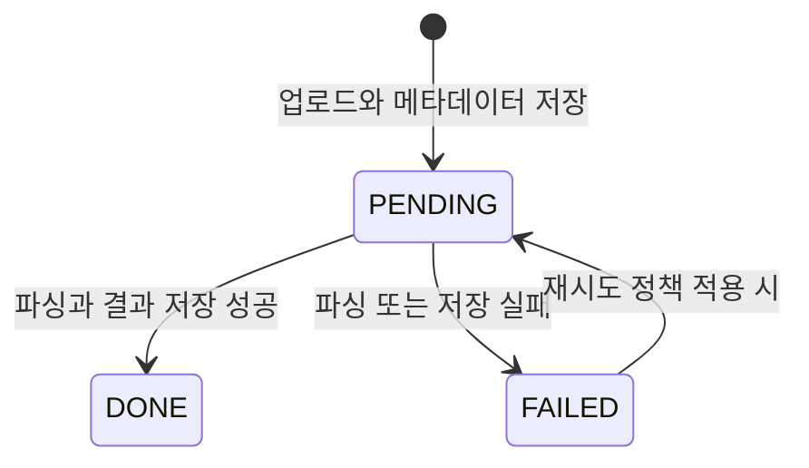
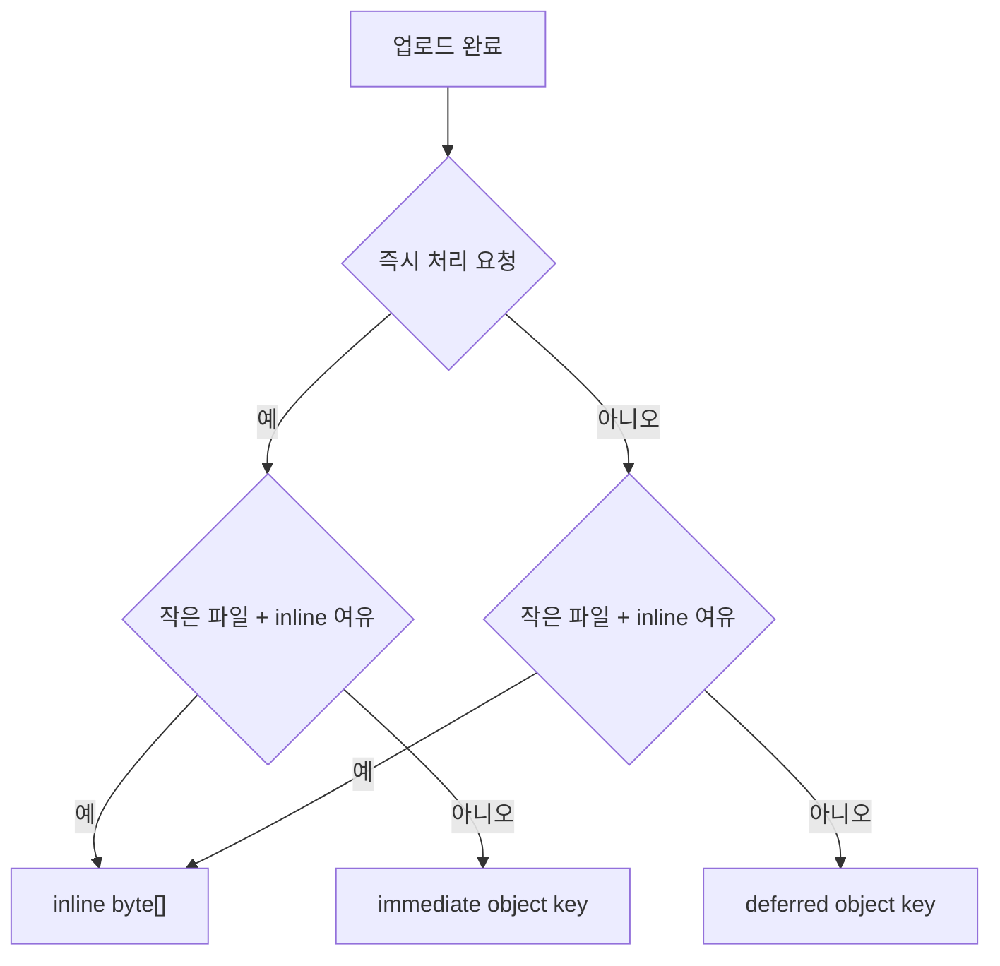
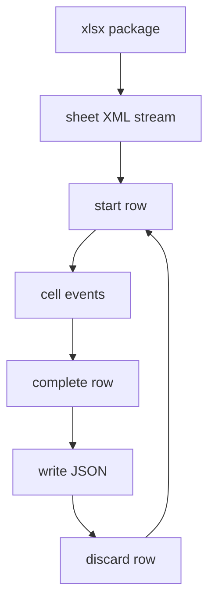

# 의사결정 기록

> [README](../README.md) · [실험 보고서](experiment-report.md) · [아키텍처](architecture.md) · [검증 범위와 후속 확인](limitations-and-next-steps.md)

이 문서는 엑셀 업로드·파싱 기능을 구현하고 개선하면서 질문과 판단이 어떻게 바뀌었는지 시간순으로 정리합니다. 완성된 답만 나열하기보다 가설, 확인 방법, 반례와 설계 전환을 남기는 것이 목적입니다.

> 회사의 내부 코드, 고객 데이터, 서버 식별 정보와 구성원 이름은 제외했습니다. 일부 수치는 당시 기록에서 확인한 관측값이며 운영 전체를 대표하지 않습니다.

## 1. 기능 요구사항

처음 주어진 요구사항은 다음과 같았습니다.

- 사용자가 `.xls` 또는 `.xlsx` 파일 업로드
- 원본 파일을 private object storage에 저장
- 업로드 사용자와 파일 메타데이터를 DB에 기록
- 파싱은 HTTP 응답을 기다리지 않는 비동기 작업으로 수행
- 가변 컬럼의 header와 rows를 JSON으로 저장·조회
- 이후 다른 기능에서도 파싱한 행 데이터 활용



여기서 `DONE`은 단순히 Excel 읽기가 끝난 상태가 아니라 최종 결과 저장까지 완료된 상태여야 합니다.

## 2. 최초 최적화 질문

업로드 요청에서 파일은 이미 `byte[]`로 heap에 올라옵니다. 비동기 worker가 다시 object storage에서 같은 파일을 읽으면 한 건당 GET 요청이 추가됩니다.

```text
업로드 요청
file.getBytes()
→ object storage PUT
→ object key를 worker에 전달
→ worker가 object storage GET
→ 파싱
```

여기서 다음 질문을 만들었습니다.

> 업로드 시 생성된 `byte[]`를 worker에 직접 전달하면 GET 한 번과 네트워크 왕복을 생략할 수 있지 않을까?

이 질문을 바탕으로 세 종류의 작업 경로를 검토했습니다.

| 경로 | payload | 원본 재조회 | 목적 |
|---|---|---:|---|
| inline | `byte[]` | 없음 | 작은 파일의 빠른 처리 |
| immediate | id + object key | 있음 | 즉시 처리가 필요한 durable job |
| deferred | id + object key | 있음 | 지연 가능한 작업 |



업로드 `byte[]`를 inline 작업에 전달하는 경로를 구현해 해당 파일의 S3 GET을 생략했습니다. 다만 어떤 크기까지 재사용할지, queue와 동시 작업을 몇 건으로 제한할지는 측정 전이라 확정하지 못했습니다.

## 3. 가설의 위험 확인

`byte[]`를 큐에 전달하면 object storage GET은 줄일 수 있지만 다음 위험이 생깁니다.

```text
heap retention time
= 업로드 처리 시간
 + queue 대기 시간
 + 파싱 시간
 + 결과 직렬화와 저장 시간
```

요청이 몰리면 큐 안의 모든 파일이 heap에 남을 수 있습니다. 작은 파일만 허용하고 queue capacity를 제한하더라도, 파싱 중에 생성되는 객체까지 고려하지 않으면 실제 사용량을 계산할 수 없습니다.

초기 예산식:

```text
inlineThreshold × (running worker + queue capacity)
```

수정한 예산식:

```text
queuedRawBytes
+ runningParserLiveSet
+ serializedResult
+ concurrentWorkerOverhead
+ safetyMargin
```

## 4. 운영 환경 확인

기능 제한값을 임의로 정하지 않기 위해 운영 환경의 자원 규모를 확인했습니다.

### 확인 항목

```bash
# 실행 중인 Java 프로세스
ps -eo pid,ppid,user,etime,%mem,%cpu,cmd | grep '[j]ava'

# JVM flag와 heap 상한
jcmd <spring-pid> VM.flags

# 현재 heap과 metaspace
jcmd <spring-pid> GC.heap_info

# 서버 전체 메모리
free -h

# 프록시 업로드 제한
nginx -T 2>/dev/null | grep client_max_body_size
```

### 일반화한 관측값

```text
RAM                  약 1.9GiB
JVM MaxHeap          약 478MiB
관측 당시 heap used   약 98MiB
Metaspace used       약 107MiB
available memory     약 575MiB
Swap                 없음
```

### 판단

- heap의 현재 여유만 보고 대용량 작업을 추가할 수 없음
- metaspace, thread stack, native memory와 다른 프로세스 고려 필요
- swap이 없으므로 메모리 부족이 OOM 또는 프로세스 종료로 이어질 수 있음
- proxy, multipart, service validation의 업로드 제한 통일 필요
- 운영 서버에서 OOM 조건을 반복 실험하지 않고 로컬 격리 환경 사용

## 5. Workbook 측정 설계

Spring, S3와 DB를 제외하고 파싱 자체의 메모리 비용을 확인하는 CLI를 구성했습니다.

### 포함

- `.xlsx`를 `byte[]`로 읽기
- `WorkbookFactory`로 전체 Workbook 생성
- header와 rows를 `List<List<String>>`로 구성
- JSON byte array로 직렬화
- 각 단계 직후 used heap과 소요 시간 기록

### 제외

- HTTP controller와 security
- object storage PUT/GET
- DB 연결과 JSONB insert
- 실제 사용자 파일
- 운영 서버 부하

이 분리는 전체 서비스 성능이 아니라 **파서의 객체 비용을 먼저 격리해 확인하기 위한 선택**이었습니다.

## 6. Workbook 결과와 반례

1,000행부터 50,000행까지 약 20개 컬럼의 합성 파일을 만들었습니다.

```text
1,000 rows   →    20,020 cells
5,000 rows   →   100,020 cells
20,000 rows  →   400,020 cells
50,000 rows  → 1,000,020 cells
```

가장 큰 반례는 파일의 압축 크기였습니다.

```text
2.306MiB xlsx
→ 400,020 cells
→ Workbook + 전체 결과 구성
→ 파싱 직후 used heap 약 408.8MiB 증가
```

```text
5.753MiB xlsx
→ 1,000,020 cells
→ Xmx512m OOM
→ Xmx768m OOM
→ Xmx1g에서 처리 완료
```

원본 `byte[]`는 약 6MiB였지만 파싱 직후 heap 증가는 약 968MiB였습니다. 이 결과로 최초 가설의 우선순위가 뒤집혔습니다.

> object storage GET을 한 번 줄이는 것보다 Workbook과 전체 결과를 동시에 유지하지 않는 것이 먼저다.

## 7. 동시성 판단의 변화

처음에는 inline queue의 파일 수만 제한하면 충분하다고 생각했습니다. 측정 뒤에는 running parser가 차지하는 메모리가 더 중요하다는 점을 확인해, inline과 durable 경로가 같은 permit을 사용하도록 설계를 바꿨습니다.

```text
MaxHeap                   = 478MiB
25% 여유 적용 예산         = 358.5MiB
baseline                 = 73MiB
large SAX 증가분          = 222 - 73 = 149MiB
small 보수적 proxy        = 124.3MiB
inline 대기 원본          = 1MiB × 4 = 4MiB

small 2 + queue          = 325.6MiB → 허용
large 1 + small 1 + queue= 350.3MiB → 여유 8.2MiB, 제외
large 2 + queue          = 375.0MiB → 예산 초과
```

이 계산으로 전체 permit 2, small weight 1, large weight 2, inline queue 4건을 초기 기준으로 정했습니다. threshold `1MiB`는 관측한 5,000행 합성 파일 `0.580MiB`를 위로 둥글린 routing 시작값입니다. 실제 동시 처리량으로 최적화한 수치는 아니므로 운영 telemetry로 재검토합니다.

## 8. SAX 조사와 구현 방향

`.xlsx`는 ZIP 안에 sheet XML, shared strings, styles 등의 파일을 포함합니다. SAX는 전체 Workbook 객체를 만들지 않고 XML 이벤트를 순차 처리할 수 있습니다.



하지만 읽기만 SAX로 바꾸고 결과를 다시 전체 List에 모으면 큰 live set이 남습니다.

```java
// 읽기만 streaming인 경우
List<List<String>> allRows = new ArrayList<>();

void onRow(List<String> row) {
    allRows.add(row);
}
```

그래서 출력까지 스트리밍하도록 설계를 수정했습니다.

```java
void onRow(List<String> row, JsonGenerator json) throws IOException {
    json.writeStartArray();
    for (String cell : row) {
        json.writeString(cell);
    }
    json.writeEndArray();
}
```

## 9. DB 쓰기와 임시 파일

행마다 DB에 저장하면 heap 사용은 줄지만 트랜잭션, 네트워크와 lock 비용이 커질 수 있습니다.

```text
SAX row event
→ row마다 DB insert
→ 수만 번의 네트워크 왕복 가능성
```

대안으로 로컬 임시 파일에 buffered write를 수행하고, 파싱 완료 후 한 번의 최종 저장을 검토했습니다.

```text
SAX row
→ JsonGenerator
→ BufferedOutputStream
→ temp file
→ parsing complete
→ final persistence
```

이 선택에도 남은 문제가 있습니다.

- 최종 JSONB insert 과정에서 driver가 전체 값을 다시 buffering할 가능성
- 임시 파일 용량 제한
- 실패·취소·프로세스 종료 시 임시 파일 정리
- 완료 표시와 최종 저장의 원자성
- JSONB 대신 object storage에 결과를 둘지 여부

## 10. SAX GC 로그 확인

동일한 합성 입력과 `-Xms256m -Xmx512m` 조건에서 SAX 스트리밍 실행의 GC 로그를 확인했습니다.

### 20,000행

```text
heap observed before GC: 약 222MiB
after Young GC:          약 73MiB
Full GC:                 기록 없음
OOM:                     기록 없음
GC pause:                대체로 3~5ms
```

### 50,000행

```text
217M -> 69M (256M) 3.616ms
```

```text
Xmx512m 처리 완료
Full GC 기록 없음
OOM 기록 없음
to-space exhausted 기록 없음
GC pause 대체로 3~6ms
```

Workbook 20,000행 로그에서는 GC가 약 30회 발생하고 일부 GC 뒤에도 사용량이 거의 줄지 않았습니다. 이는 전체 Workbook과 결과 객체가 계속 참조되어 Young GC 이후에도 살아남는 구조와 일치합니다.

## 11. 최종 판단

### 채택한 방향

- `.xlsx` 기본 파싱은 SAX event 방식
- 행 단위 처리 후 즉시 streaming output
- 검증된 소형 파일은 bounded inline queue에서 업로드 raw bytes 재사용
- 대형·queue 포화·재시도는 id와 object key를 durable 경로로 전달
- 모든 파싱 경로가 공유 permit 사용
- 결과 저장 성공 뒤 `DONE` 전환
- 실패 사유 기록과 임시 파일 정리

### 확대하지 않은 단정

- 전체 AWS 청구 비용을 50% 절감했다
- SAX가 항상 더 빠르다
- 50,000행을 운영 상한으로 지원할 수 있다
- 동시 small 2건이 실제 트래픽의 최적값이다

## 12. 초기 적용 값과 운영 검증 항목

```yaml
parser_worker_max: 2
parse_permits: 2
small_job_weight: 1
large_job_weight: 2
inline_queue_capacity: 4
inline_threshold: "1MiB"
durable_fallback: id_and_object_key

max_upload_size: validate_with_real_workbooks
max_rows_and_cells: validate_with_real_workbooks
end_to_end_throughput: validate_with_real_traffic
overall_cost_effect: validate_after_deployment
```

inline 파일은 S3 접근이 `PUT + GET` 2회에서 `PUT` 1회로 줄어 접근 횟수 기준 50% 감소했습니다. 전체 AWS 비용 감소율은 inline hit ratio, 요청 단가, 저장·전송·다른 서비스 비용을 포함해 운영에서 확인해야 합니다. 이 구분은 미완료를 뜻하는 것이 아니라, **구현한 구조·계산한 초기값**과 **운영에서 측정할 KPI**를 바꾸어 말하지 않기 위한 것입니다.

## 기록의 의미

이 사례에서 가장 중요한 결과는 특정 라이브러리를 사용했다는 사실보다, 다음 순환을 실제 측정으로 수행한 것입니다.


기록은 정답만 정리하기보다, 잘못된 전제를 발견하고 질문을 바꾼 과정을 보존합니다.
